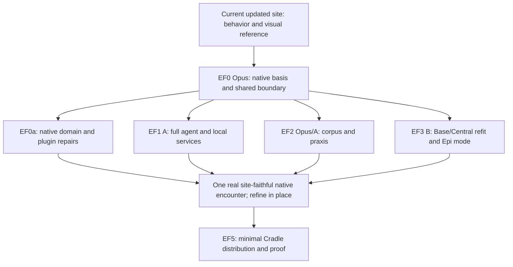

# Central Field — site-led Base/Cradle refit and Epi-Logos distribution

**Owner direction, consolidated 6 October 2026.**  
**Implementation:** the owner's main machine; O:I branch `feat/central-field-base`.  
**Team:** Opus lead, one or two Sonnet implementers only.  
**Parent:** [O:I #592](https://github.com/EpiLogos/O-I/issues/592).  
**Map publication:** [PR #596](https://github.com/EpiLogos/O-I/pull/596), `docs/epi-logos-field-wayfinder-20261006`.  
**Current deliverable:** a site-led redesign of **Base / Central in the existing Cradle app**, shipped as a genuine minimal O:I installation with full QL/MEF and Epi-Logos.  
**Excluded products:** Software Factory and Workcell.  
**Later horizon:** progressively refit the fuller product field and shared-field experience into the refined foundation; [#594](https://github.com/EpiLogos/O-I/issues/594) remains deferred.

This replaces the earlier standalone-app and Cradle-led-layout instructions. The same canonical file and ticket identities are retained. Earlier revisions remain provenance, not competing execution instructions. The branch is for reviewable development of the existing application, not a permanent Cradle fork or separate app identity.

## 0 — Intent, scope and direction of development

### 0.1 What the person should receive

Someone arrives at the updated O:I site, enters the essay's graph–pages–Expressions field, obtains the local edition and companion, and continues in an O:I Cradle installation whose **Base, labelled Central**, carries the site's successful interaction. The full existing QL/MEF agent, local Kev, Redis-backed preparation, reader/expressive praxis and public corpus are part of the selected installation.

The native application adds real agency, editing, constructive Expressions/Technē, durable reader work and continuation. It preserves the site's ability to read, follow a tangent, inspect relations and return without losing the question that made the exploration meaningful.

This is not an isolated essay tab surrounded by the old Cradle experience. The new interaction belongs to Base/Central itself. Epi-Logos mode/world then supplies its corpus, domain agent, QL/MEF instruments and practices over that same foundation. An ordinary linked local Project uses the same Base without acquiring essay-specific semantics.

### 0.2 Owner-authored corrections and their reasons

The owner first established the full capability basis:

> “we have existing full ql agent, the experiemtns are good, mef plus local kev model too super good, aikit comes with full redis stack too”

The next correction fixed the direction of UX authority:

> “we still want to be ensuring the UX comes formo the existing updated site, or at least porting the ocnventions in th UX porpelry over to the cradle in the process”
>
> “the process long term is develop the minimal system then refit the full product field into this”

The latest instruction makes the application and architecture scope explicit:

> “the UI being agent native and built for composability/plugin paradoigm, with decoupled domain type archietcure, should mean that these kinds of UI change are not an issue at the level of business logic; if this approahc/intent has been violated anywhee then this is the chance to amend this”
>
> “this apply to the BASE mode, the CENTRAL mode... the system wouldnt have factory or workcell, but it WOULD be have ql-mef and epi-logos mode right”

The previous main-machine correction still holds. Develop and refine on the **main machine**, not Omarchy. The earlier request to defer desktop porting now means deferring the **wider product-field refit and shared-host rollout**; it does not prohibit the Base/Cradle work explicitly commissioned here.

### 0.3 The development movement

```text
Updated site's working essay-field interaction
                   ↓
Site-led Base/Central in the existing Cradle application
                   +
Full selected native agency, QL/MEF, Kev, Redis and corpus
                   ↓
Minimal install + real use + refinement on the main machine
                   ↓
Distributable O:I configuration and maintained simple entrance
                   ↓  later owner-directed horizon
Refit wider native products and shared-field participation into it
```

Preserve native domain meaning, contracts and data; improve how the person encounters and operates them. Existing Cradle widgets are implementation material, not blanket UX authority. Reuse those that carry the intended behavior; recompose or refactor those that prevent it. The site is more than a skin to copy: its coordinated navigation is the reference.

The full product refit is not switching all old panels back on. Each later contribution must become intelligible through the improved common interaction while retaining its domain-specific tools and native ownership. That later work does not gate this release.

### 0.4 Exact installation and mode composition

| Layer | Included now | Meaning |
|---|---|---|
| Application | Existing O:I Cradle identity, kernel, installation/update and workspace mechanisms | Base/Central is the redesigned default work surface; no new standalone reader application |
| Operational foundation | Central #0, Actuation #1, AIKit #2 | The existing 0/1/2 core |
| Formal/domain contribution | QL-MEF / Quaternal Logic #5 | Explicitly installed and discoverable, including its native operations/faculties; not a hidden prompt substitute |
| Epi-Logos | Mode/world configuration, existing full agent and practices, essay and Expressions | Specialises the same Base; does not become a new product position or exclusive home for the redesign |
| Local intelligence/services | Local Kev and AIKit Redis-backed preparation, selected Pi or Prime body | Full configured capability; lifecycle participates through existing native provider seams |
| Excluded products | Software Factory #3; Workcell #4 | Neither is installed, required, silently reached or presented as a broken prerequisite |
| Deferred environment | Shared-field hosting and full-product UX refit | Existing future architecture remains available; deployment/refit is not in this pass |

Positions describe actual product membership, not a new invented Context Frame or CLI install-mode string. Extend the existing requested/effective composition and `oi.profile/v1` model so it reports **0/1/2 plus selected QL** honestly. Epi-Logos is the world/mode specialisation, not a seventh product.

Use the existing `base`/Central arrangement and Epi world/context/mode ownership rather than minting another competing mode state. Epi mode-off and another ordinary corpus exercise the improved Base; mode-on activates the real source-qualified agent/tools/practices. Preserve explicit user model/harness choices and supported turn/session boundaries.

Minimal means fewer products and a focused encounter, not less QL capability. A selected service temporarily failing is different from an intentionally unselected product. Package a coherent normal start with repair paths for actual failures, not a screen of missing Factory/Workcell warnings.

## 1 — UX authority: the updated site, transferred into native use

### 1.1 Required source entry

Read `site/ESSAY-FIELD-LAYOUT-2026-10-05.md`, then inspect and run the **current updated site** on the main machine. Record its source/deployed/local build basis and any newer owner-approved local changes. The October 5 file is the explicit reference entry, not a freeze against later accepted improvements.

Follow the actual implementation:

- `site/vendor/quartz/quartz/components/scripts/field/{core,reader,tabs,graph,explorer,search,library,shell}.ts`;
- `site/vendor/quartz/quartz/components/Field.tsx`, its `renderPage.tsx` and `styles/field.scss`/`custom.scss`;
- `quartz/util/essayField.ts`, `plugins/emitters/fieldIndex.ts` and `util/expressionIndex.ts` under the same vendor tree;
- `site/essay-expressions.mjs`, `essay-expression-map.json`, `build-essay-quartz.mjs`, `expression.html` and `src/expression/`;
- `site/tests/essay-reader-controls.py`, `essay-host-smoke.py` and relevant site model/Expression tests.

Read the current test paths/scripts before execution. Existing browser tests are executable behavioral references, not proof that this branch has passed them.

### 1.2 Transfer the interaction, with its reason

| Ref | Site convention | Why / native requirement |
|---|---|---|
| UX1 | One locus coordinates page position, contents, graph, explorer and address | One meaningful current subject drives the encounter. In Base generalise to native subject/page/span; essay movement information comes from its adapter. |
| UX2 | Main page versus tangent preview; keep, replace, promote and return | Explore a source without losing the primary inquiry. Preserve separate preview slots where needed for page and Expression. Dirty editable material cannot be discarded by preview replacement. |
| UX3 | Click selects; double-click opens; drag moves a node; explorer/pager/breadcrumbs navigate main | Inspection, presentation manipulation and navigation have different effects. Keyboard and agent operations express those same distinctions. |
| UX4 | Graph and connections list share filters and the same neighbourhood | The visual and text accounts agree. “Here” uses the same actual eligible neighbourhood, not a separately guessed list. |
| UX5 | Breadcrumb footer exposes ancestry, folder contents and siblings | Make return and lateral exploration available without reconstructing paths. Native refs remain authoritative underneath displayed paths. |
| UX6 | Fast title/path search, deeper full-text loading only when needed, located results | Give useful response immediately; retain richer native retrieval without waiting for every optional provider or full corpus download. |
| UX7 | Expressions indicated on pages, tree, graph and connections; contextual Library; Expressions as tabs | An Expression is another encounter with the same field, not an unrelated gallery. Preserve source/aboutness, scenes and the route back. |
| UX8 | Essay/Split/Field/Library change emphasis; collapsible rails and responsive drawers | Let the main activity take space without losing access. Adapt labels appropriately for generic Base while retaining the site's behavior. |
| UX9 | Actual typography, whitespace, figures/captions, tokens, link behavior and theme | The reading experience is part of the contract. Copying colours alone is not fidelity. Preserve image dimensions/loading so reading position stays stable. |
| UX10 | Site navigation has explicit actions and shared state | Map these onto native presentation/application operations, source refs and revision-aware state. Site ordinals/DOM/slugs are not the agent's domain API. |

Capture before/after interaction walks and the relevant actual visuals. Each transfer record names the source behavior, native implementation, reason for any departure and evidence. Test selection, preview, keep, promote and return as separate operations; a screenshot or component inventory does not establish fidelity.

### 1.3 Native enrichment, not regression to old chrome

Use the site's reading and field hierarchy as the starting composition of Base. Do not bury it inside the old Base shell with duplicate title bars, mode rails, graph panels or tab stacks. Native windows, resizing and advanced tools should add useful power without reinstating the fragmentation this work addresses.

Keep the graph/contents/connections depth useful when introducing the companion. Reusing Cradle's chat mechanics does not require replacing the site's field with a permanent chat sidebar. Develop summonable/pinned/focused companion placement through actual use with the owner. Its context follows the active locus or an explicit pin, including the relation between the main inquiry and the current tangent.

Technē remains **the focused Expressions projection of graph constellations**. Enter/gather a constellation from the Base field, work it through existing native instruments, save a reader-owned result and return. Existing Expression/Technē capabilities and domain depths remain available; this is not a requirement to redesign every specialist instrument before the minimal Base works.

Port or reuse the site code at the smallest suitable boundary. Direct reuse of render/style modules is welcome; adaptation to native source/action/persistence is required. A permanently opaque embedded website whose actions cannot participate in the native field does not finish the task. Equally, do not rewrite the entire site merely to impose React or a new state library.

## 2 — Agent-native composition and domain boundaries

### 2.1 Desired architecture

```text
Site-led Base presentation / native Epi specialisation
              ↕
Typed host interaction + common selection/continuation
              ↕
Admitted contribution / capability / action dispatch
              ↕
Owner-native domain operations and data
 Central | Actuation | AIKit | QL-MEF | Expression owner
              ↕
Actual source, services, tools, events and returned evidence

Human control and agent invocation meet the same admitted operations.
A different presentation does not silently change domain meaning.
```

The host owns composition, presentation state and lifecycle. Domain contributions own their semantics, native types, rules, durable data and operations. Retain typed discriminated results, capability/ref identity and revision/authority handling; do not reduce decoupling to untyped arbitrary JSON or a universal graph database.

Source reads/writes, relation authoring, QL computation, agency and persistent artifact effects remain at native owners. Preview/promote/layout/selection can be host-native application operations with their own visible effects. Both people and agents can use them without scraping the rendered interface. Component selection or a successful animation does not confer domain authority.

Use the current contribution/SDK and compile-time admission rules; plugin composability does not require unrestricted dynamic code loading. A contribution can provide its renderer, tools, context description, settings, requirements and lifecycle through actual public seams. Domain-specific data must not be passed through universal host props just because one product was integrated first.

### 2.2 Scoped audit and repair — EF0a / #598

This is implementation work in the active tranche. Audit the producer/consumer boundaries traversed by Base, Epi, agent and minimal installation; extend along any discovered coupling until its owner can be repaired. Do not demand a complete suite census before starting the first vertical.

For every violation retain: source revision/path/symbol; intended relation; concrete behavioral consequence; owning contract; repair; tests; affected consumers; any genuinely broader follow-up. Fix required native seams rather than writing feature-local workarounds. Domain invariance is the expectation, not an assumption that existing code has already earned.

Confirmed source entry points from the 6 October review, to reconcile with current local successors:

- `desktop/cradle/src/contributions/contracts.ts` puts `FactoryCentreContext`, `factoryCentre` and `factoryTasks` inside the common hosted mount contract. `CradleFrame.tsx`, static modes and the generated registry have Factory-specific integration. Refactor the domain context behind its contribution and prove the common host independently. Imports alone are not evidence a runtime process launches.
- `workspace/mode.ts`, `store.ts`, menu/action registration, restoration and startup effects must consume the actual composition. A hidden icon is not product absence. Preserve legitimate historical bindings and explicitly unavailable optional surfaces while new minimal workspaces start cleanly.
- AIKit `crates/aikit-cli/src/decide.rs` distinguishes Workcell-owned `managed-local` from a standalone compatible `endpoint`. Use the actual endpoint/provider path for local Kev without Workcell. The endpoint configuration alone is not full lifecycle: bundle/provision startup, health, stop, restart and upgrade through the appropriate existing native local-service/provider path. Apply the same inspection to Redis and agent/body placement. If current paths assume Workcell, repair that assumption at the native boundary while retaining provider identity and useful lifecycle.
- `desktop/cradle/package-bundle.sh` presently builds a shared-field client and checks it in the macOS payload. Make build/package resource selection reflect the current local composition, without forcing hosted/shared rollout. Distinguish passive client assets from actual required services and record the chosen package closure.
- `epilogos/sources.ts` has a receiving-only essay adapter; `EpiLogosSurface.tsx` has old title copy and a generated-Markdown/no-relative-assets assumption. Bind the real current corpus through the source adapter and richer Base rather than polishing that disconnected doorway.
- Site field node ordinals, static maps, movement counts and page addresses are projection details. Translate them to native stable refs and exact source/aboutness relations. Keep useful static indices and caches derived and rebuildable; do not replace native source ownership with the site model.

No requirement here to transplant all business logic out of files merely to satisfy a directory aesthetic. The test is whether native behavior is owned, invocable and independently testable without dependence on incidental UI layout or unselected products.

### 2.3 Small common contract

Opus records the current native types/actions for these relations; names here describe meaning, not mandatory new schemas.

| Relation | Required basis |
|---|---|
| Encounter | World/project, primary inquiry, active native subject/source revision, page/span/anchor, tangent/pin, constellation membership, Expression/scene and selection generation |
| Presentation actions | Select, open-main, open-preview, keep, promote, back/return, field emphasis and focused constructive entry; distinct effects and supported keyboard/agent invocation |
| Prepared turn | Relevant source neighbourhood/practice and full QL/Kev service readings where used; AIKit/Redis prepared version actually delivered to the particular turn |
| Domain action | Owner/tool/action ref, eligibility and authority, expected revision, actual input/result/effect, cancellation and refusal |
| Continuity | Reader-owned notes/traversal/results, current agent and real runtime session/handover, meaningful unsaved state and restore refs |
| Contribution | Identity, owner, typed contract, renderer/tool/settings/context/lifecycle bindings, required capabilities, admitted presence and removal behavior |

Extend current KernelOp, native Actions, component contracts and context APIs. Keep native durable work, retained runtime resource state and view/workspace presentation distinct. A new layout is not another source database, agent session or cache policy. In-flight turns keep their actual delivered basis while new selections affect subsequent input.

### 2.4 Genuine absence and full selected operation

The target release has neither Factory nor Workcell installed, registered, callable on PATH or silently supplied by another personal-machine installation. The minimal build must not require a Workcell source checkout or Factory business library to render Base or run its companion. Optional contribution source can remain in the monorepo for the full build; the selected build/runtime path excludes its mandatory role.

Ordinary local processes, Redis, model serving and material-address metadata are legitimate without installing the Workcell product. Prefer existing non-Workcell endpoint/local adapters; where a lifecycle contract is currently overcoupled, repair/reuse the correct native provider implementation. Do not create a second Workcell manager in the reader, falsely label the endpoint Workcell-managed, or remove Kev/Redis to obtain a green absence test.

The included QL-MEF product and Epi mode are real. Report registered/effective versions and actual native operation. Epi mode-off demonstrates generic Base; it is not permission to omit QL from this distribution. Factory Run ancestry is unnecessary for ordinary reader work, direct agent actions, notes or Expression construction.

## 3 — Delivery graph and working branch

### 3.1 Active tickets

| Packet | Ticket | Work | Primary lane |
|---|---|---|---|
| EF0 | [O:I #592](https://github.com/EpiLogos/O-I/issues/592) | Site baseline, current native basis, small contracts, first real connection, integration and owner review | Opus |
| EF0a | [O:I #598](https://github.com/EpiLogos/O-I/issues/598) | Agent-native/plugin/domain boundary repairs and true no-Factory/no-Workcell conformance | Opus, delegated A/B by owner |
| EF1 | [Actuation #132](https://github.com/EpiLogos/Actuation/issues/132) | Full agent, Workcell-independent Kev/Redis/provider path, Pi package, Prime fork and native companion binding | Sonnet A |
| EF2 | [Essay #78](https://github.com/EpiLogos/Antykathera-Essay-Work/issues/78) | Complete public World, site-to-source mapping and reader/expressive SkillSet/Methods/Methodologies | Opus semantic entry; A integration |
| EF3 | [O:I #593](https://github.com/EpiLogos/O-I/issues/593) | Site-led Base/Central redesign, generic use, Epi mode, Expressions/Technē and actual refinement | Sonnet B |
| EF5 | [O:I #595](https://github.com/EpiLogos/O-I/issues/595) | Minimal Cradle distribution/profile, clean absence tests, both harnesses and upgrade/continuity | Opus; existing A/B lanes |

**Deferred:** [EF4 / #594](https://github.com/EpiLogos/O-I/issues/594) now holds **progressive wider-product refit and shared-field work**. It no longer describes porting a separate essay app back into Cradle. It has no automatic dispatch or current release dependency.



EF0a proceeds with the vertical, not as a gate requiring every audit item finished before any view is built. Package scaffolding starts early. Finish with actual absence and conformance evidence.

### 3.2 Branch and installation isolation

The dedicated remote implementation branch is **`feat/central-field-base`**, created from O:I main. The map remains published through #596 until merged; read its current version directly without resetting a checkout. Integrate the reviewed map into the feature line through ordinary Git operations, preserving newer source and active work. The documentation publication branch is not a stale runtime baseline.

Before local checkout/switch, inspect the main-machine source seat, dirty state and existing writers. Use an assigned seat for the feature line. One feature-line checkout/worktree is sufficient; create another only for a real ownership conflict, not one per Sonnet. Native-repository changes use corresponding scoped branches only where needed, with exact dependency refs recorded in the parent. Do not mass-clone all repositories or reset unpublished work.

Develop the new Base on this feature line, with the normal full-build contracts regressed but no forced update of the owner's everyday installation during iteration. Use existing development launch/data-root selection to give the feature an isolated candidate profile and test state. Preserve the production app identity for distribution; an isolated development build does not commission a second enduring application or updater.

Opus owns shared schema/selection/kernel/host boundary decisions and serializes Git/index/commit, generated registries, install and conflicting service operations. Workers can implement shared files under exclusive claims. Retain main-machine platform/architecture facts, not the old Omarchy/Linux assumptions.

### 3.3 Team and first useful increment

Opus retains whole-product intent, site reference, semantic entry, architecture repair decisions, integration and actual review. Sonnet A carries runtime/native/provider/package/corpus joins. Sonnet B carries site transfer/Base presentation/contribution integration and first-run UI. Use one Sonnet sequentially or two on disjoint claims; no nested workers or additional review swarm.

Each task includes the ticket, why the change matters, exact source/contract basis, writable files, expected native act, runnable test and return requirements. Returns contain actual files/commits, operations, executed tests/results, remaining fault and next action. Cross-review or fresh reuse of a freed slot supplies independent checking.

End EF0 preparation with a real connection:

`current site passage → same passage in new Base → relation/tangent → real companion → source → actual Expression → return`.

Then finish the full corpus, constructive operation, generic Base, Epi mode and lifecycle over that path. Provide the owner the actual candidate launch route on the main machine and refine there before the broader refit.

## 4 — Packet implementation and source entry

### EF0 / EF0a — Intent into native structure

Begin from `docs/positions/FOUNDING-POSITIONS.md`, this owner's correction, site UX sources and current repository/seat instructions. Capture one main/tangent/Expression reference walk and a performance baseline. Inspect only the native boundaries needed to connect it, publishing the contract in section 2.3. Fix domain/UI coupling along the way and add regression tests at the actual owners.

The architectural proof combines unchanged native domain readbacks, equivalent agent/human actions, a public contribution specimen and the true product-absence run. The UI can change substantially without an implicit source or business-rule rewrite. Explicit required contract improvements retain their reasons and compatible consumers.

### EF1 — Full QL agent, services and two distributable bodies

Continue Actuation #107, QL-MEF #258/#291 and AIKit #388/current code. Reuse the existing full QL/MEF faculties, harmonics, recurrence, model decision and prepared-context services. No new training programme or default election is needed for this delivery.

Package the actual Pi extension and requested Prime harness fork over the same source-owned tools/practices. Pin actual selected upstream versions, adapter imports and fork delta at execution. Connect native session start/stream/tool/results/cancel/resume through the current supported SDK/RPC/process boundary. The app is Cradle, not a new reader runtime.

Use the native non-Workcell local endpoint/provider path for Kev and supply its complete lifecycle. Keep the AIKit Redis preparation online without requiring Workcell or Factory. Where this exposes missing local lifecycle or dispatch separation, implement the repair at the appropriate existing native owner and feed #598. Both bodies must actually consume QL operations, Kev results and delivered prepared context.

Provider login/API key are authentication choices inside Pi/Prime setup, not another agent runtime. The speaking model, harness, enduring companion and local decision model have distinct identities. Native credential ownership, user selection and truthful continuation survive model/harness changes. UI actions and user/agent commands use the same source/operation boundary.

### EF2 — Complete public World and praxis

Canonical authoring stays in `Antykathera-Essay-Work/submission-package/essay/` and the current structural/orienting sources. Reader practices originate in `submission-package/epi-logos/`. Follow current source-to-Expression editions and the site's current `essay-expressions.mjs`/`essay-expression-map.json` rather than treating inventories as artifacts or resurrecting the retired public shelf as the UX.

Preserve rooms/movements, A/A′/C/A-C/S depth, Symbolon/Matheme/Mytheme/Episteme, source houses, actual diagrams/media/captions, profiles/scenes and exact aboutness/source bindings. Use current authored title/entry; old filenames remain locators. Release dependency closure distinguishes internal dependencies from deliberately external/withheld sources. Package the full intended public field, not all private working files.

Make an Epi source/World contribution that supplies native refs, hierarchy, reader adapters and domain-specific metadata to generic Base. Site slugs, movements and family labels do not become universal host types. Static indices remain derived, source-pinned projections; live reader results follow their native owner.

Compose existing orientation, walk-the-essay, linked-vault/source, pedagogical, investigative and specialist QL/MEF practices with constructive Expression/Technē operations. `METHOD:` and `METHODOLOGY:` remain classifications over existing Skill identity/lifecycle, composed through native SkillSets. Support natural conversation through the actual encounter, deep inquiry and a useful next ground. Notes, traversal, generated interpretations and authored work keep their attribution and are saved into the reader's World without modifying the publication through ordinary reading.

### EF3 — Site-led Base/Central, with Epi mode over it

This is the redesign of the `base` arrangement labelled Central in Cradle. Implement UX1–UX10 in its common native structure, not only inside `EpiLogosSurface` or a new essay-only mode. The site leads hierarchy, interaction and visuals; Cradle provides reusable kernel/resource/Surface/agent/Expression machinery and the native powers to enrich it.

Carry main/tangent/keep/promote/return, joint locus, graph/text filtering, contextual Library/Expression links, source reading and responsive focus. Extend preview conventions for writable/native work: keep unsaved changes, release or suspend rich renderers correctly and restore meaningful state. Avoid duplicate tab owners and state stores.

QL/MEF and Epi mode supply their real agent/body, corpus and practices on the same Base. Demonstrate another local linked corpus with Epi mode off, then mode-on with full domain tools and continuing inquiry. Do not force ordinary Base to manufacture QL metadata. Existing Expressions and focused Technē remain accessible through the same subject/constellation relationship.

Place companion controls without erasing the useful site field; make the agent able to operate selection/open/preview/construct/return via typed native operations. Refine the actual application with the owner on the main machine. A colour/theme copy or old Base with a hidden Factory button is not the intended result.

### EF5 — A real configuration of the existing system

Use `oi.profile/v1`, current-world/composition, contribution/package, desktop footprint and native installer/update mechanisms. Supply one coherent minimal configuration of the **existing app**, plus versioned World/praxis/model packages. The product set is Central, Actuation, AIKit and QL-MEF, with Epi-Logos and local Kev/Redis, and no Factory/Workcell product.

Complete the profile-to-install-to-first-workspace connection. A compatible existing O:I installation receives the profile/World without losing other workspaces, settings, agents or data. Do not uninstall the owner's Factory/Workcell to simulate minimality. Prove real absence in an isolated clean installation instead.

Prefer one application code line and contribution-aware startup. If reducing artifact size needs selected frontend/native build features or resource manifests, keep them in the same build pipeline and identity. Audit transitive dependencies, not merely navigation visibility. Build target follows the main machine's real OS/architecture; the website download and independent Pi/Prime distribution remain in scope, but a new hosted companion/shared-field rollout does not.

Publish tested install/open/repair/update commands, actual artifacts, platform/size/prerequisites, source/revision manifest and a useful first run. Detect/provision local services, then use native model login/API-key configuration. Reading/graph/Expressions stay usable while authentication completes or remote inference is unavailable; included service faults have truthful recovery. Updates/rollback preserve notes, main/tangent position, scenes, saved constructions and real session continuity.

### Current native source anchors

| Source | Purpose |
|---|---|
| `desktop/install-footprint.json`, `cli/src/{desktop_command,desktop_install,current_world,composition}.rs`, `cli/src/configuration/profile.rs` | Existing app identity, requested/effective presence, profiles and native lifecycle |
| `desktop/cradle/src/{workspace,contributions,surface,kernel}/`, Cradle/CradleFrame and actual successors | Base, contribution admission, host operations, resources and continuity; inspect source-backed coupling points in section 2.2 |
| `desktop/cradle/src/{knowledge,material,files,expressions,expression,techne,epilogos,agent,encounter}/` | Native source reading, page/graph/Expression joins and actual companion/action routes |
| `desktop/cradle/kernel/`, `src-tauri/` and current O:I public Actions | Domain/host dispatch, native bridge and production authority |
| AIKit decision/endpoint, Redis/NOW/context, portable-package, model/session/source implementations | Full local intelligence and non-Workcell native runtime path |
| Actuation's current Epi/Prime/owner/faculty/relational/toolset sources; QL-MEF #258/#291 and native implementation | Full agent and common body tooling |
| O:I `agent-praxis-document-world` and relevant Wiki/constellation position/spec; essay `AGENTS.md`, `WRITING-PROTOCOL.md`, orienting/structure/production sources | Practice and source authority, alongside the new site-led UX authority |

Follow current successors and local improvements without resetting them. Each worker reads the bounded sources for its packet; this table is navigation, not a mandatory giant context injection.

## 5 — Acceptance, metrics and Return

### 5.1 Current proving matrix

Two installation contexts, each with Pi and Prime:

| Context | Pi | Prime |
|---|---|---|
| Clean minimal Cradle: selected products only, Factory/Workcell absent | Complete walk and absence proof | Complete walk and absence proof |
| Isolated candidate profile in the owner's richer existing installation | Same Base/Epi walk; other workspaces preserved | Same Base/Epi walk; other workspaces preserved |

These are four current **installation/harness checks**, not the old three-host/six-cell programme. Shared-host and cross-world contribution tests remain deferred. In each context verify generic Base with another linked corpus and Epi mode-off/on; the change must not be trapped in the essay specialisation.

The main-machine full installation may contain extra products. Presence there never satisfies the separate clean-absence test and must not contaminate it through PATH, source fallback, environment, service discovery or credentials.

### 5.2 Complete encounter and site fidelity

From the genuine profile/package route: open the current essay in Base; move through its reading locus; select a graph relation without navigation; open a tangent; replace, keep and promote it deliberately; return to the main passage. Search and breadcrumb navigation retain their distinct effect. Graph and connections filters agree.

Ask a substantive source-grounded question; inspect the actual prepared turn basis and relevant native operations. Open a source from the answer as an appropriate tangent without losing the main inquiry. Enter a real Expression/scene and continue; gather/enter a constellation, focus it in Technē, perform a permitted constructive act, save a reader-owned variant/result, rediscover it and return. Quit/reopen; continue from meaningful native state. Repeat site-reference behaviors by pointer and keyboard; exercise equivalent agent operations through the native API.

Capture current site reference and native candidate at comparable viewports, including narrow and reduced-motion states. Preserve natural typography, image/caption treatment and reading position. Record deliberate improvements or departures with their reason and actual owner feedback.

### 5.3 Architectural tests

- **Product absence:** no installed/registered/resolved Factory or Workcell, no mandatory transitive checkout/binary/service calls, no fake success handler. Tripwire unexpected discovery/dispatch. QL/MEF, Kev, Redis, chat, source navigation and constructive return still work.
- **Agent-native equivalence:** structured and human invocations agree on native refs, revision, admission and intended effect; presentation changes remain distinguishable from source/domain mutations. No DOM/screenshot dependence for semantic operation.
- **Public contribution:** a small non-essay source/surface/tool admitted through the existing public SDK/manifest/compile-time path works without editing host business logic; removal preserves historical bindings truthfully. Reuse existing conformance fixtures where sufficient.
- **Domain invariance:** existing owner conformance tests and exact native readbacks remain valid before/after presentation changes. Contract evolutions are explicit, bounded and tested with their consumers.
- **Generic Base/Epi:** ordinary corpus works under Base with Epi off; Epi uses the same interaction with full QL/MEF agent/practices. No hard-coded essay filenames, counts or lens tables in generic host semantics.
- **Isolation/regression:** existing personal workspace/data/credentials survive candidate use, install/adoption/update. Full contribution-enabled code still passes its relevant contract/type tests without commissioning the wider UX refit.

### 5.4 Numerical evidence

Fix source/corpus/model/artifact/hardware and task basis. Report exact pass counts, denominators, samples, raw observations and failures. Map these into existing capability/account and test evidence rather than creating a competing global quality system.

| Measure | Required result |
|---|---|
| UX transfer | UX1–UX10 behavior checks on native candidate against site reference; exact departures/decisions recorded |
| Product independence | Zero required/resolved Factory or Workcell calls in the clean run, with actual QL/Kev/Redis work succeeding |
| Installation/harness coverage | Four specified context/harness checks completed; login and API-key coverage named independently |
| Source and corpus | Live release page/asset/Expression counts; zero unresolved *declared internal* dependencies after explicit external/withheld dispositions; zero wrong ref/revision substitutions |
| Native operation | Source-grounded QL/action success, actual Kev results and Redis-prepared context delivered/used, agent/human equivalence |
| Correctness | Zero unintended publication writes, private/credential disclosures, unauthorized effects or stale results/writes admitted as current |
| Continuity | Main/tangent/pin/reading/scene/draft, notes/constructions and supported session return through view switches, restart, update and rollback |
| Responsiveness | Cold/warm launch, page/graph readiness, input latency and first useful answer; Kev/preparation overhead separate from LLM latency |
| Resources | Install footprint; peak/settled memory and relevant VRAM; renderer/listener/service counts over 30 repeated transitions; no orphan accumulation after settled teardown |
| Architectural repair | Each required violation linked to native fix and regression; public contribution conformance and ordinary/full-build regressions |

Inherit applicable performance budgets; otherwise set concrete limits against the first main-machine baseline **before tuning**. Do not present a relative improvement over an unusable baseline as sufficient. Qualitative refinement is actual owner use and review, alongside these numbers.

### 5.5 Faults and recovery

Exercise corrupt/missing/incompatible artifacts, absent native login, lost model connection, Kev/Redis restart, slow graph/source provider, source revision during streaming, rapid selection, cancellation, dirty preview replacement, interrupted construction, process restart and interrupted install/update. Disconnect a real native action/context producer to ensure its test fails. Test removed optional contribution restore without making it a new-install warning wall.

Keep reading and available local operations useful during provider loss. Restore and retest the full selected configuration after faults. Preserve failed receipts. An actual unavailable entitlement or human review remains an exact named evidence item, not simulated completion or a reason to stop other implementation.

### 5.6 Completion and later horizon

Deliver the new site-led Base/Central in the same Cradle code line and installation identity, with explicit minimal composition, QL/MEF/Epi mode, full native companion/practices and complete public World. Required domain/plugin/capability violations are repaired and regressed. Install and run it without Factory or Workcell; also use its isolated profile within the richer installation without disturbing existing work.

Return exact branch/commits/native dependencies, contribution and provider contracts, compatible release manifest, Pi package/Prime fork, tested install/open/update commands, actual site/native screenshots, numerical results and the owner's real feedback. Keep #592's current packet, file claims, decisions, remaining fault and next action current; concise NOW/ticket handoffs preserve continuity across worker replacement.

Only after refining this foundation does EF4 revisit Factory, Workcell, other product interfaces and shared meta-Central. They retain their native business meaning while their presentation is deliberately fitted to the improved Base. Preserve the useful minimal configuration as a permanent supported entry even when the full field grows.

**Immediate finish line: the site's functionally apt encounter has become a genuinely agent-native, composable Base/Central in O:I, with the full selected Epi capability and real product independence.**