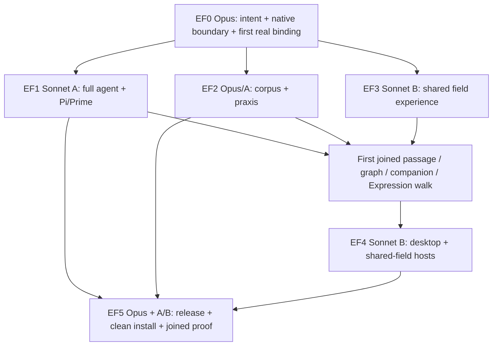

# Epi-Logos Field — full agent, authored World, shared encounter

**Owner commission:** 6 October 2026.  
**Execution host:** Omarchy.  
**Execution lead:** Claude Opus, with **one or two Sonnet implementer subagents only**.  
**Integration parent:** [O:I #592](https://github.com/EpiLogos/O-I/issues/592).  
**Standing:** commissioned product direction and executable ticket map; implementation and experience receipts are added by the executing team.

This file is the canonical map for EF0–EF5. The parent issue is the live integration/decision ledger. Delivery issues retain native changes, execution state and evidence. Changes to intent or contracts are recorded here and linked from affected tickets, rather than silently diverging between worker prompts.

## 0 — What we are bringing into the world

### 0.1 The destination

A person comes to the O:I site, obtains the Epi-Logos agent together with the authored essay and Expression corpus, opens a small local application, configures their conversational model through Pi or Prime login/API-key setup, and begins exploring the World with its full QL/MEF companion.

The essay application is the concrete place in which we establish the complete **graph–pages–Expressions–companion experience**. We carry that working implementation into desktop Explore and O:I web/shared-field experiences. The essay is the first rich proving World, not a special-purpose interface whose design must later be rebuilt for the real product.

Graph makes relations and bounded wholes available. Pages let the person enter their articulated substance. Expressions give those same subjects and relations expressive, spatial, temporal and interactive form. The person can move among these presentations while the subject, inquiry and companion remain continuous.

**Technē is the focused Expressions projection of graph constellations.** A gathering within the field becomes a focused workspace in which the person and agent can examine, arrange, express, make and return material. The established professional instrument depths continue to supply their differentiated powers within this relation.

The shared field relativises a user's local Central within its meta-Central field. The wider field makes participating worlds and their relations encounterable while each originating World remains intelligible and independently grounded. Entering a shared field, entering a participant World, opening its pages and Expressions, contributing, and returning locally are movements through this same experience.

### 0.2 Preserve the owner's actual correction

The immediate source of this map is the owner's conversation on 6 October 2026:

> “we have existing full ql agent, the experiemtns are good, mef plus local kev model too super good, aikit comes with full redis stack too”
>
> “the full experience of the graph + pages + expressions is what the desktop shared field/explore/o-i web experience OUGHT TO BE”
>
> “shared field just reltaivises the local users Central within its meta-Central field”
>
> “with techne being the focused expressions projection of the graph constealltions”

These are the authored direction, retained verbatim so that downstream engineering stays connected to the reason for this work.

The execution basis is the **existing full QL/MEF agent, existing experiments and native tools, local Kev, and AIKit's full Redis-backed stack**. The work makes that capability distributable and experientially coherent. Smallness describes the installation/entry experience and focused app shell, not a reduced agent, stripped corpus, prompt-only substitute or optional-by-default decision/context stack.

The simple **0/1/2** foundation composes **Central, Actuation and AIKit**, retaining the current native product numbering. QL/MEF, local Kev and required service material participate through existing package/provider/lifecycle relations. Users need not assemble the internal products by hand.

### 0.3 Relation to existing work

This is a bounded delivery tranche within the existing product field. Its cross-product reference is [O:I #220](https://github.com/EpiLogos/O-I/issues/220); its Explore/reference-host relation is [O:I #18](https://github.com/EpiLogos/O-I/issues/18). It consumes the full-agent programme [QL-MEF #258](https://github.com/EpiLogos/QL-MEF/issues/258), shared Prime/Pi decision/tool work [QL-MEF #291](https://github.com/EpiLogos/QL-MEF/issues/291), acting body [Actuation #107](https://github.com/EpiLogos/Actuation/issues/107), and native decision/prepared context [AIKit #388](https://github.com/EpiLogos/ai-kit/issues/388).

QL-MEF #291 records O:I #65 as historical acceptance provenance. Retain useful inherited scenarios and evidence machinery, leave that campaign closed, and record this tranche through #592 and current owner tickets. Older proposals for many workers, Mac-first execution or a smaller reader-only package do not override this commission's **Omarchy + Opus + at most two Sonnet implementers + full configuration**.

The current authored positions in [FOUNDING-POSITIONS.md](../../docs/positions/FOUNDING-POSITIONS.md) remain the upstream product ground. Current code identifies the implementation to extend; it does not redefine this commission's intended encounter.

## 1 — The experience the implementation must carry

The EFX labels below are local trace keys. Link them to current native capability/account/experience records; they do not establish another suite-wide taxonomy.

### EFX01 — Arrive and begin

The website explains the field through what the person can do and offers a real downloadable app/World. First run supplies the configured foundation, QL/MEF, local Kev and Redis path; then the person chooses Pi or Prime and a supported login/API-key model route. They can read while authentication completes. Harness, speaking model and local decision model have clearly different roles in the interface.

### EFX02 — Know where one is

Make three relations legible: the containing World/field, the constellation currently being explored, and the particular subject in focus. Search, opening, typed-neighbour expansion, recentering, back/forward and history preserve exact native refs. A complete corpus is reachable through indexed discovery and bounded neighbourhoods; a graph view need not render every node at once to preserve the whole.

### EFX03 — Read the real work

Render the actual publication with its typography, Markdown/HTML, media, links, wikilinks, backlinks and heading/block/span destinations. A page has real argumentative or expressive substance. Opening source depth retains the path back to the originating passage. Graph and page resolve the same link/occurrence rather than deriving conflicting relations independently.

### EFX04 — Move between page, graph and Expression

Selecting a passage or subject makes its relational situation available. Following a graph connection opens its real page or Expression. An Expression's subjects and sources remain addressable through native portals/front-verso/deep-open. Back restores the same page anchor, selection and meaningful scene state. Related views change the form of encounter, not the identity of what is encountered.

### EFX05 — Enter Technē from a constellation

The person can enter an existing constellation or gather one from actual subjects/passages. Technē opens it as focused expressive work with the current native tools: member/role inspection, presentation arrangement, supported relation operations, glyph/text/media composition, scenes and saved results. Keep the six established professional instrument depths available as differentiated ways of working, not a compulsory step sequence.

An authored interpretation, a native semantic relation and a spatial arrangement retain their distinct meanings. This lets the person explore and make freely while keeping the source basis intelligible.

### EFX06 — Speak with the companion from here

The companion receives the current page/span, subject, constellation, Expression/scene, containing World and relevant inquiry through AIKit's existing context preparation. QL/MEF faculties, local Kev, source work and the appropriate practices operate on this encounter.

A question such as “why are these related?” is already situated. The person does not reconstruct the page or selection in chat. The answer can open a source, show a relation, gather a constellation, enter an Expression or perform a permitted constructive action through the same native operations the human uses. Full tool/praxis capability remains available; each turn receives the relevant part.

### EFX07 — Sustain a conversation, not a per-page chatbot

Reuse the current Cradle conversation stream, composer, tool/result presentation and native session bridge. The continuing reader inquiry survives navigation, view changes and restart. Follow-current and pinned-subject states are explicit. A new selected subject informs subsequent input while an in-flight answer remains attributed to the context supplied to that turn.

Changing model or harness preserves the durable inquiry through supported continuation/handover. Runtime session identity is reported truthfully; preserving the reader's thread does not require pretending every provider uses an identical transcript format.

### EFX08 — Return something into one's World

Reader notes, questions, traversal records, new constellations, Expression variants and other results are saved through their native owners with source provenance. The person can find and reopen them later. Publication updates preserve these reader-owned returns and the source basis they refer to. Ordinary reading leaves the authored publication intact.

### EFX09 — Use the same experience in desktop Explore

Mount the same field components and state orchestration in real desktop local-World/Explore destinations. Open the essay and at least one other local Project or eligible object through that generic boundary. Preserve existing workspace/Surface/companion placement and current Expressions design. Porting means running the shared implementation in this host, not producing a lookalike shell.

### EFX10 — Enter and participate in the shared field

The open shared field contains participating Worlds; entering one reveals its eligible graph, pages, Expressions and agents/resources. World provenance remains visible. Cross-world relations and shared constellations become addressable subjects themselves.

A person can make an eligible attributed contribution and observe its reception from another independently grounded World. Local return brings a relation, reference, note or new composition back into their own context. Existing Projection/Participant/Contribution/Encounter and meta-Central relations supply the semantics.

### EFX11 — Keep the encounter responsive and inhabitable

Give the main subject generous space with summonable/resizable graph navigation and companion. Graph, page or Expression can take the foreground; the underlying inquiry remains. Preserve keyboard operation, link copying, text selection, visible focus, narrow layouts, reduced motion and current Expressions/O:I design tokens.

Retained reads, indices, in-flight work and subscriptions belong in the existing runtime resource layer, above disposable views. Warm navigation should feel immediate; current state and meaningful drafts restore together. Profile actual cold/warm use and repeated switching against a fixed Omarchy basis.

### EFX12 — Install, update, recover and continue

The distribution is reproducible from pinned artifacts, not the developer's checkout. Compatible existing installations can be adopted; clean-user installation is isolated from the owner's live World. Missing services or credentials have an ordinary repair/retry path. Interrupted updates and compatible rollback preserve reader state. The full configured stack is restored after fault tests rather than silently replaced with a lesser default.

## 2 — Shared composition and implementation boundaries

### 2.1 One encounter implementation, several hosts

```text
Current authored essay + source/argument/room field + real Expressions
                               |
                 Central / native source World
                               |
       shared graph / page / Expression / Technē encounter
                    <-> continuing companion
                               |
                 AIKit context, praxis, discovery
                 + existing Redis preparation
                               |
           full QL/MEF + local Kev + Actuation body
                      /                 \
               Pi extension        Prime harness fork

The same encounter components and state orchestration mount in:
   local essay wrapper | desktop local Explore | shared-field O:I web

Shared frame:
   local Central/World -> eligible native Projection/participation
                     -> containing meta-Central / SharedField
                     -> encounter / contribution / local Return
```

Authentication is a choice within the selected harness/provider route. API-key setup does not create a third agent runtime. Model credentials remain with their native owner. The website can connect to the installed companion through the existing authenticated session/channel relation without acquiring the provider's credentials.

### 2.2 Native ownership

| Owner | Responsibility in this tranche |
|---|---|
| Essay repository | Authored publication, argument/source structure, reader practices and corpus/source-to-artifact bindings |
| Central | Persistent authored/readership ground, World/project/source identity, reader-local continuity and accepted source returns |
| AIKit | Model/harness and capability composition, Skill/Method/Methodology/SkillSet disclosure, source/search/context, local decision provider and Redis preparation through current seams |
| Actuation | Existing acting body, agency/session/activity/authority and native Prime execution relations |
| QL-MEF | Full formal/MEF faculties, source-defined lenses/harmonics and common native operations used by both bodies |
| Current Expression owner/engine | Expression/Profile/Scene/Edition and constructive material/renderer operations |
| O:I | Shared encounter UI, native composition/host adapters, shared-field relations, public packaging and website entry |
| Existing material/service provider | Current process/model/Redis lifecycle and resource placement, consumed through existing installation contracts |

O:I composition keeps these owners connected. It does not need another model roster, corpus database, coordinate registry, credential store or agent identity to do so.

### 2.3 EF0's small integration contract

Opus publishes the exact current native types/actions for the following relations. These are semantic requirements over existing types, not prescribed new schema names.

| Relation | Required content | Producer → consumer |
|---|---|---|
| Current encounter | Containing/local/shared World; originating World; selected subject/source and revision; page/span/anchor; constellation and membership revision; Expression/Scene; selection generation; inquiry/session relation | Native source/UI selection → all views and AIKit preparation |
| Prepared act context | Eligible bounded source neighbourhood, current question/practice, QL/Kev reading where used, prepared version, delivered basis for that act | AIKit/Redis → actual Pi/Prime invocation and inspectable receipt |
| Native operation | Exact action/tool identity, subject/ref, admitted effects/authority, input revision, result/receipt and cancellation | Human or agent → native owner → all affected consumers |
| Continuing inquiry | Reader-owned question/traversal/notes/results plus canonical Agent and runtime session/handover refs | Central/native session owners → restore/navigation/companion |
| Expression/constellation return | Native artifact/revision, members and source bases, authored layout versus semantic relation, actor and return destination | Technē/Expression/native owner → source discovery and reader World |
| Host/projected resolution | Originating refs, Projection/participant/audience/currentness, material transport and permitted operations | Local/shared provider → the same encounter implementation |

For each row retain a compact binding: `experience clause → native symbol/action/file → current revision → writer → consumer → test → observed result`. Extend the existing capability/account records with those references. A working mock contract is useful during isolated development but the joined encounter invokes actual native owners.

### 2.4 State and lifecycle

Preserve the current three responsibilities: native durable data and work; retained runtime resources and in-flight requests; view/workspace presentation. Native identity is shared across views. Resource caching is revision- and access-scoped. Presentation remembers focus, camera, panels and scroll without copying semantic objects into a UI-only world.

A source change invalidates affected readings and prepared context. A later result cannot overwrite a newer selection, source or edited composition. In-flight turns keep their actual delivered basis. Hidden rich views release/suspend resources through the current render owner while native agent work can continue. Restart rehydrates refs and meaningful checkpoints through the existing continuity path.

### 2.5 Public/local boundary

The release includes the intended public corpus and admitted media/editions; reader-local notes, private authoring transcripts and personal Central/credentials stay in their respective Worlds. Manifest closure follows explicit source/asset relations, not an indiscriminate repository copy. External bibliography remains available when the underlying third-party work is not redistributed.

Shared-field eligibility is applied before search, counts, adjacency, assets, cache reuse and agent context. A web-to-local companion connection is origin/session-bound and uses current authorization. Untrusted rendered HTML/Expression content has no ambient local-file, shell or credential authority. Reuse native sandbox/portal/channel policy. Fault tests exercise these boundaries while the normal experience remains straightforward.

## 3 — Ticket map, owners and bounded dispatch

### 3.1 Published delivery graph

| Packet | Ticket | Primary responsibility | Dependencies and exit |
|---|---|---|---|
| EF0 | [O:I #592](https://github.com/EpiLogos/O-I/issues/592) | Opus: intent, first concrete encounter, shared contract/file claims, integration, current-state ledger and verification | Begin immediately. Exit preparation with a real source/view/agent binding and dispatchable native interfaces; continue as integrator throughout. |
| EF1 | [Actuation #132](https://github.com/EpiLogos/Actuation/issues/132) | Sonnet A: full agent, local Kev/Redis integration, Pi package, Prime fork and native session bridge | EF0 interface; EF2 praxis consumed as it lands. Exit with real package discovery/invocation and usable stream/action/continuation in both bodies. |
| EF2 | [Essay #78](https://github.com/EpiLogos/Antykathera-Essay-Work/issues/78) | Opus semantic entry; Sonnet A corpus/praxis joins | Source work begins during EF0; packages bind through EF1. Exit with complete public corpus/Expression closure and useful source-qualified reader/expressive praxis. |
| EF3 | [O:I #593](https://github.com/EpiLogos/O-I/issues/593) | Sonnet B: shared graph/pages/Expressions/Technē/companion experience | EF0 boundary and EF2 real source specimen; integrate EF1 early. Exit with a working local wrapper and reusable complete encounter implementation. |
| EF4 | [O:I #594](https://github.com/EpiLogos/O-I/issues/594) | Sonnet B + Opus host integration: desktop and shared meta-Central | Starts against EF3's stable shared exports; consumes EF1/EF2. Exit with the same implementation mounted and exercised in both real hosts. |
| EF5 | [O:I #595](https://github.com/EpiLogos/O-I/issues/595) | Opus release/proof; A package/install; B site/first run | Packaging scaffolding starts early; full release consumes EF1–EF4. Exit with public downloadable artifact, clean Omarchy install and six-cell joined proof. |



### 3.2 EF0 — Opus creates the first executable ground

Read the intent and current small set of source/operation anchors. Resolve actual local source seats, active writers, installed configuration and relevant native entrypoints. Keep that a bounded reconciliation of this deliverable. The owner has supplied the full agent/stack as the starting capability; the preflight identifies the versions and exact joins to use.

Select a real passage, its argument/source neighbourhood and an existing linked Expression. Identify the initial reader question and expected source-opening/expressive action. Capture current interface behavior and a first performance baseline. Publish the small contract in section 2.3 and explicit file claims. Make the first actual source/view/runtime connection, then dispatch A/B and keep integrating.

Opus is the single decision owner for shared selection types, host/session bridge, root workspace/state, generated registries and serialized integration mutations. A worker may implement a specifically delegated change to one of these files while that claim is exclusive; ownership does not imply that Opus must hand-code every shared change.

### 3.3 EF1 — Deliver the existing full body in both harness routes

Continue the existing native agent and QL-MEF #291 package/tool seam. Produce a real Pi extension package and the requested distributable Prime harness fork, with source-owned practices and full native tools/faculties. Retain the native QL kernel/MEF/decision implementation; adapters handle target integration. Record the current Prime upstream basis and patch delta from the existing source configuration.

Integrate the actual SDK/RPC/process session path, stream, tool results, cancellation and resume. Bring the supplied local Kev and Redis preparation online through native installation/lifecycle. Ordinary model setup uses the harness/provider's actual login or API credential path. EF1 tests both packages from their distributable boundaries before handing them to EF5.

### 3.4 EF2 — Make the complete essay World and praxis portable

The canonical release source remains `Antykathera-Essay-Work/submission-package/essay/`, with the current authored title/entry discovered there. Preserve rooms/movements, A/A′/C/A-C/S depth, the four registers and linked source/media structure. Resolve the actual Expression/Profile/Scene/Edition artifacts through the production alignment and current collection; retain their source bindings and full expressive assets.

The existing Reader Companion supplies the starting reader practice: `using-epi-logos`, `walk-the-essay`, `okf-wiki`, `converse-pedagogically`, `investigate` and specialist operations. Compose this with the full QL/MEF and current expressive practices. Reconcile the exact `METHOD:` and `METHODOLOGY:` Skill classifications and SkillSet selection; add only missing functions at their native source.

Required methodological functions are dialogical reading, source investigation, QL/MEF inquiry, constellation/Expression participation, pedagogy/traversal and reader-owned Return. The companion speaks naturally through the encountered material and uses explicit formal vocabulary when it clarifies the actual question. The full repertoire is available through selective context rather than being flattened into a permanent prompt.

### 3.5 EF3 — Make the local encounter good, with reuse built in

Reuse/extract the existing Cradle graph, page, Expression, Technē and conversation components with current Expressions design. Build the actual continuous selection/deep-open/return and constructive paths in EFX02–EFX08. The small wrapper selects the essay World and companion configuration around this shared implementation.

Implement current-subject and pinned-scope behavior, stable streaming-turn attribution, page/scene/constellation restoration and reader return. Make linked reading and complete corpus discovery pleasant and responsive. Preserve actual glyphs, media, text, scenes and native authoring rather than substituting presentation placeholders. Publish component/state exports that EF4 actually consumes.

### 3.6 EF4 — Port faithfully by mounting the same implementation

Mount EF3 in desktop Explore/local-world destinations and shared-field web. Host adapters supply scope, source/projected resolution, transport and existing workspace/session placement. Interactions, selection, page/Expression rendering and constructive actions remain shared.

The shared-field walk uses two independently grounded Worlds. Enter and leave a participant World, gather a cross-world constellation, make an attributed permitted contribution, observe it from the other World and return locally. Show originating World and containing field. Test reconnect and revocation through actual current provider infrastructure. The web companion binds the installed agent through the native authenticated channel; an additional hosted agent service is not required by this tranche.

### 3.7 EF5 — Make the public route real and prove the joined result

Use existing O:I package, edition, install/update and website release machinery to publish compatible artifacts for the verified Omarchy/Linux target. Include the full configured stack and current corpus. Provide a real app preview and a concise first-run path, with independent Pi-package/Prime-fork instructions for existing harness users.

Build/release artifacts rather than requiring public users to build the full development suite. Verify clean installation in an isolated HOME/config/service namespace, existing-install adoption, retry/update/compatible rollback and reader-state preservation. Record exact tested commands from implemented entrypoints. Carry the complete walk through all three hosts and both harness routes before the parent's software-delivery verdict.

### 3.8 Opus and the two Sonnet lanes

| Role | Continuing responsibility |
|---|---|
| Opus | Whole-product intent, source/contract selection, first real binding, EF2 semantic ground, shared integration and write serialization, decisions, reviews, joined runtime/UX/release proof |
| Sonnet A | EF1 → EF2 package/praxis/runtime joins → EF5 artifact/install/update work |
| Sonnet B | EF3 → EF4 → EF5 website/first-run/host work |

Use one Sonnet when the work is sequential; use two only for disjoint packets. These are implementation lanes, not additional runtime domain agents. Workers do not spawn workers. Independent review uses the other implementer or a fresh reuse of a freed slot; the team never expands into a separate reviewer swarm.

Each dispatch includes: linked ticket and experience clauses; purpose and expected change; exact source entrypoints and inherited contract revision; writable files; read-only dependencies; test command/specimen; return format. Each return contains: actual change, files/commits, operations, executed tests/results, remaining exact fault and next actionable step.

Reuse current assigned feature-line checkout/source seats and native NOW/claim/messaging machinery. Preserve unpublished work. Give shared Git/index/commit, generated files, installs and heavy builds one owner at a time. Reuse build outputs/caches; avoid concurrent heavyweight Rust builds on Omarchy. Extra worktrees are not the default means of parallelism.

## 4 — Execution order, source entry and evidence

### 4.1 Concrete checkpoints

**C0 — First ground:** Opus records the chosen real reading encounter, current full-stack bindings, small shared contract and claims. A real source/view/runtime connection ends preparation.

**C1 — First joined encounter:** open a passage → reveal its graph relation → ask the actual companion → open a real source → enter an actual Expression → return to the original passage. A and B join early, before separately polishing every package or panel.

**C2 — Complete local World:** finish complete release-corpus closure, praxis, native constructive Technē, save/rediscovery and restart. The initial specimen expands to the complete selected public field; it is not the release ceiling.

**C3 — Same experience in its other hosts:** desktop local Explore, then shared-field web, with the same components and native refs. Exercise real inter-world participation and local Return.

**C4 — Public distribution:** versioned artifacts, app/site entry, clean user-root install, auth/model selection, update/recovery, and full-stack readiness.

**C5 — Joined verdict:** six host/harness cells, quantitative correctness/continuity/performance and actual experiential review. Retain failures and fixes, then repeat the affected full walk.

The C labels are local checkpoint shorthand, not a replacement for any inherited campaign phase meanings. Apply the current native evidence mappings when recording results.

### 4.2 Smallest sufficient source entry

Read the map and assigned ticket first. Follow the source needed for that packet; a worker does not load every document in the programme by default.

| Source | Why it matters / who needs it |
|---|---|
| O:I `docs/positions/FOUNDING-POSITIONS.md` | Opus: authored meaning and native ownership; workers receive relevant clauses. |
| O:I `.wayfinder/maps/wiki-constellation-development.md` and linked `docs/positions/WIKI-CONSTELLATION-PRACTICE.md`, `docs/experience/WIKI-CONSTELLATION-UX.md`, `docs/cradle/WIKI-CONSTELLATION-SPEC.md` | Opus/B: existing connected-reading, constellation-making, resource continuity and Return design. |
| O:I `.wayfinder/maps/agent-praxis-document-world.md` | Opus/A: native Skill / METHOD: / METHODOLOGY: / SkillSet / World relation. |
| O:I current `techne-expression-mode`, `expression-production-suite` maps; #335/#375 | B: shared stage, portals/front-verso, existing shell/companion and full Expressions grammar. |
| QL-MEF #258/#291; current Epi agent architecture and native owner implementation | A/Opus: reuse full agent/MEF/harmonic/Prime/Pi implementation and source-owned tools. |
| Actuation #107; `docs/EPI-LOGOS-AGENT-ARCHITECTURE.md`; current `epi_agent`, `prime`, `prime_run`, `faculty`, `owner`, `relational`, `policy`, `toolset` | A: body/runtime/session/recurrence/faculty composition. |
| AIKit #388 and actual model/decision/session/portable-package/context/NOW/service modules | A: full local Kev/Redis configuration, real composition and delivery. |
| Essay `AGENTS.md`, `WRITING-PROTOCOL.md`, current orienting/structural sources, `docs/REPOSITORY-SHAPE.md` | Opus/A: affected publication authority and current anatomy. |
| Essay `submission-package/epi-logos/`, `submission-package/essay/`, `docs/EXPRESSION-CORPUS-PRODUCTION-ALIGNMENT.md` | A/Opus: existing reader practices, live publication, real artifact bindings and release closure. |
| O:I `desktop/cradle/src/{knowledge,expressions,expression,agent/chat,agent/panel,surface,workspace,kernel}/` and actual successors | B/Opus: shared UI, selection, native handoff, resource continuity and host mounting. |
| O:I #18 and current SharedField/Projection/Participant/Contribution/Encounter/SpaceTimeDB paths | B/Opus: local Central within the containing shared field, actual transport and participation. |

Read relevant local repository/seat instructions and current owner claims before editing. The paths above are source locators; when a native implementation has moved, record the successor once in the binding ledger and continue from it. Local unpublished improvements are part of the current source relation and must survive integration.

Upstream references for versions selected by EF1: [Pi package contract](https://github.com/earendil-works/pi/blob/main/packages/coding-agent/docs/packages.md), its adjacent extension/session documentation, and [Prime Agent](https://github.com/PrimeIntellect-ai/prime-agent). The Pi package reference was observed on 6 October 2026 redirecting from the former `badlogic/pi-mono` location. Pin actual releases/import contracts rather than treating a mutable documentation page as a compatibility lock. Preserve the existing Prime origin and native composition identified by the local configuration.

### 4.3 Joined acceptance matrix

| Host | Pi package | Prime fork |
|---|---|---|
| Small local essay application | J1 complete encounter | J2 complete encounter |
| Desktop local Explore | J3 complete encounter | J4 complete encounter |
| Shared-field/O:I web with installed companion connection | J5 complete encounter plus shared participation | J6 complete encounter plus shared participation |

The complete encounter:

1. Enter from the public artifact/host route and resolve the intended full configuration.
2. Open the current authored essay and read a passage.
3. Follow its graph/argument/source depth using exact links.
4. Ask a substantive question needing more than one linked part of the field; inspect the useful answer and relevant delivered context.
5. Deep-open a source from the companion's answer and return.
6. Enter a real related Expression and continue the conversation from that scene.
7. Gather or enter a constellation; open it in Technē; perform a permitted constructive act and save a reader-owned composition/variant.
8. Find that result through native discovery and return to the original question.
9. Quit/reopen and continue the same reader inquiry with the actual native runtime/session disposition.

For J5/J6, add two independently grounded Worlds, cross-world navigation/constellation, one attributed contribution seen from the other participant, shared-service reconnect and revocation. Keep controlled test principals and actual human encounter evidence identified separately.

Cover both supported login and API-key authentication routes across the delivered harnesses. A missing external entitlement is an exact provider-evidence gap, not a reason to abandon native implementation or claim a login passed. Public instructions say precisely which route was demonstrated.

### 4.4 Source-rich dialogue specimens

EF2 selects current real sources for these repeatable questions: a multi-page argument; a source-depth investigation; a whole Mytheme whose later movement qualifies its beginning; a Matheme/formal inquiry using actual QL operations; a constellation-to-Expression act; and continuation from a previous inquiry. Preserve source refs and answer/action criteria without prescribing prose.

Evaluate usefulness, fidelity to source, appropriate depth, coherent voice and actual tool/action success. Use held-out criteria or independent review where comparing behavior. Do not turn a numerical pass/fail score into a replacement for reading the answer and encountering the app.

### 4.5 Measurements and concrete correctness targets

Fix corpus/artifact/task/model/hardware basis before comparing builds. Report raw observations, sample count, numerator/denominator and failures. Preserve current native metrics/receipt machinery and map these checks into existing capability/account records.

| Measure | Required return |
|---|---|
| Distribution completeness | Current page/asset/Expression counts; every declared internal release dependency resolves or has a reviewed external disposition; unresolved internal dependency count reaches zero. |
| Reference fidelity | Page → graph → Expression → companion/tool → saved-result round trips; target zero wrong native-ref/revision substitutions. |
| Full-agent operation | Successful native QL/MEF tools and useful acts in each body; actual Kev result and Redis-prepared context used, not only installed-process presence. |
| Host parity | J1–J6 completed, with the same component imports/interaction contract and native semantics; denominator six. |
| Continuity | Restart, update, view switches and explicit harness handover checks; reader notes/traversals/compositions retained. |
| Correct effects and access | Zero unintended publication mutations, private-canary/credential disclosures, unauthorized effects and stale writes/results applied as current. |
| Installation | Download/install/first-open duration and artifact footprint under a named clean Omarchy user-root; successful retry, update and compatible rollback. |
| Response | Cold/warm page-ready and graph-ready time, UI input latency, time to first useful answer; Kev and prepared-context timing separate from LLM latency. |
| Resources | Peak/settled RSS, relevant VRAM, active renderer/subscription counts and growth over 30 repeated transitions; zero orphan renderer/listener set after settled teardown. |
| Comparative quality | Source-grounded answer/action completion counts, exact failed cases, actual model/token/resource cost and independent qualitative review. |

Use inherited performance budgets when they apply. Otherwise Opus records concrete latency/memory limits from the first real Omarchy baseline **before tuning** and tests the same workload after changes. Report and repair misses; a percent improvement over an unusable baseline is not sufficient to call the experience good.

### 4.6 Fault and recovery cases

Exercise corrupt/missing release asset, wrong version, missing model authentication, provider disconnect, local Kev/Redis restart, slow graph provider, source revision while a turn streams, rapid selection changes, cancellation, interrupted composition, process restart, interrupted download/update, shared-service loss and projection revocation. A private canary checks search/counts/graph/assets/caches/context together. A disconnected native action/context producer must fail the corresponding integration test.

Each fault returns to the useful activity it interrupted. Restore and retest the full configured path. Native/source correctness, actual provider/material operation, UI interaction and human judgement have their respective evidence rather than one misleading aggregate verdict.

## 5 — Return, release and completion

### 5.1 What stays live during execution

The parent ledger carries active packet, owner, claimed files, current interface revision, actual completed change, executed evidence, remaining fault and next executable action. Child issues link native commits/PRs and detailed results. Keep the source-to-capability/operation/control mapping current as interfaces change. Document an interpretation or contract change with its reason and update affected consumers deliberately.

Existing NOW/continuation and native messaging carry worker progress. A replacement worker receives the current ticket, concise delta and exact refs, rather than a retelling of the whole investigation. Shared Git/build/install changes remain serialized and attributed.

### 5.2 Release material

EF5 returns the real public/download entry, release/version manifest, downloadable app/World artifacts, actual Pi package and Prime fork refs, verified install/open/repair/update commands, and native source/rebuild instructions. The manifest ties together compatible publication, Expression, praxis, QL/MEF, Kev, AIKit/Central/Actuation, renderer/app and harness versions.

The site uses the current authored publication title. Legacy filenames remain compatibility locators. The release retains provenance and required notices for admitted content/software. The clean install does not depend on the author's absolute paths or unpublished development seats.

### 5.3 Whole completion

The full QL/MEF companion, local Kev and AIKit Redis preparation operate through both delivered harness routes. The complete selected public essay and real Expression corpus are locally available. A person can read, explore relations, converse, enter Expressions, gather and work a constellation in Technē, save a meaningful return, quit/reopen and continue.

The same experience is mounted in desktop local Explore and the shared-field web, where a participant's local Central is encountered within the containing meta-Central field. Actual inter-world participation returns to native ground. Website distribution and clean installation make this available beyond the developer checkout.

Return the six-cell matrix, exact source/build/artifact basis, native action/context/decision receipts, measured performance/resources, continuity/recovery results and representative actual screenshots. Retain the owner's experiential judgement separately and plainly. Software delivery can be reported precisely without inventing that judgement.

**The finish line is the person entering and using this whole encounter from the public distribution boundary.** Opus keeps implementing through the packet graph to that result, with one or two Sonnet implementers, and leaves any genuinely external missing evidence as an exact named item alongside everything actually delivered.
