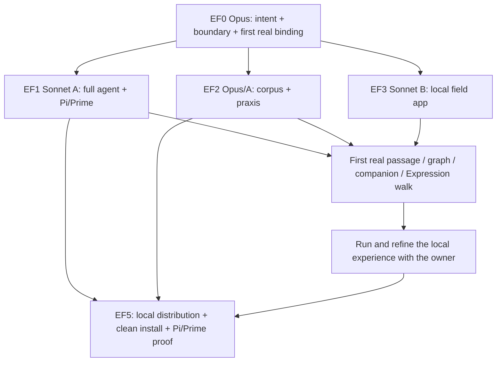

# Epi-Logos Field — full agent and local authored World

**Owner commission and scope amendment:** 6 October 2026.  
**Execution host:** the owner's **main machine**.  
**Execution lead:** Claude Opus, with **one or two Sonnet implementer subagents only**.  
**Integration parent:** [O:I #592](https://github.com/EpiLogos/O-I/issues/592).  
**Current delivery:** build, package, run and refine the standalone local essay field.  
**Deferred:** EF4 host porting, after local experience refinement.

This file is the canonical map for the local delivery. The parent issue holds current integration/decisions; delivery issues retain native changes and evidence. The original wider-port scope is preserved in [#594](https://github.com/EpiLogos/O-I/issues/594) as follow-on work, not a current task or completion dependency.

## 0 — What we are bringing into the world

### 0.1 Current scope and reason

The owner's latest correction is:

> “we dont want to have the deksotp side of this in the prompt as we'll need to refine it in place before the porting... and also we wont do it on omarchy we can just do it on main machine”

Develop the complete local essay app, inspect and refine it with the owner **in place on the main machine**, and package the full agent/World. Porting comes later, after this experience has been refined. EF4 is outside current dispatch, prerequisites and acceptance. Neither green local tests nor completing a package automatically starts that follow-on work.

The O:I website download/installation entry remains in scope. That is distribution of the local app, not implementation of a shared-field web app. Reuse the existing Cradle components/native contracts required by the local app without rolling the new experience into the suite shell or building other-host adapters now.

Use the main machine's actual native platform and architecture for the first build/install artifacts and measurements. The former Omarchy/Linux target is superseded. Preserve current source seats, active writers, installed services and private Central on the main machine.

### 0.2 The local destination

A person comes to the O:I site, obtains the Epi-Logos agent together with the authored essay and Expression corpus, opens a small local application, configures their conversational model through Pi or Prime login/API-key setup, and explores the World with its full QL/MEF companion.

Graph makes relations and bounded wholes available. Pages let the person enter their articulated substance. Expressions give those same subjects and relations expressive, spatial, temporal and interactive form. The person moves among these presentations while the subject, inquiry and companion remain continuous.

**Technē is the focused Expressions projection of graph constellations.** A gathering within the field becomes a workspace in which the person and agent can examine, arrange, express, make and return material. The current professional instrument depths retain their differentiated powers inside this local experience.

### 0.3 Retained originating intent

The preceding owner-authored ground remains:

> “we have existing full ql agent, the experiemtns are good, mef plus local kev model too super good, aikit comes with full redis stack too”
>
> “the full experience of the graph + pages + expressions is what the desktop shared field/explore/o-i web experience OUGHT TO BE”
>
> “shared field just reltaivises the local users Central within its meta-Central field”
>
> “with techne being the focused expressions projection of the graph constealltions”

The execution basis is the **existing full QL/MEF agent, experiments and native tools, local Kev, and AIKit's full Redis-backed stack**. Smallness describes installation and the focused app entrance, not a reduced agent, corpus, prompt-only substitute or optional-by-default decision/context stack.

The simple **0/1/2** foundation composes **Central, Actuation and AIKit**, retaining current native product numbering. QL/MEF, Kev and required services participate through existing package/provider/lifecycle paths. Readers should not have to assemble internal products by hand.

The eventual wider experience remains a product direction: the refined local implementation can later be carried into desktop Explore and shared-field web, with local Central situated within meta-Central. Keep reusable source/selection/action boundaries now; execute the actual port only in the follow-on #594. The local app is where the design is developed and refined first.

### 0.4 Existing work and provenance

The local tranche consumes [QL-MEF #258](https://github.com/EpiLogos/QL-MEF/issues/258), [QL-MEF #291](https://github.com/EpiLogos/QL-MEF/issues/291), [Actuation #107](https://github.com/EpiLogos/Actuation/issues/107), [AIKit #388](https://github.com/EpiLogos/ai-kit/issues/388) and current native code. [O:I #220](https://github.com/EpiLogos/O-I/issues/220) remains the integration relation. [#18](https://github.com/EpiLogos/O-I/issues/18) is wider-port provenance, not an assignment for this session.

QL-MEF #291 records #65 as historical acceptance provenance. Retain useful existing scenarios and evidence machinery without reopening it. Older multi-worker, Omarchy-first and immediate-port instructions are superseded by **main machine + Opus + at most two Sonnet implementers + full local configuration + in-place refinement**.

[FOUNDING-POSITIONS.md](../../docs/positions/FOUNDING-POSITIONS.md) remains the upstream product ground. Current code identifies what to extend; it does not redefine the intended encounter.

## 1 — Experience clauses

EFX labels are local trace keys connected to current native capability/account records, not another suite taxonomy.

### EFX01 — Arrive and begin

The site offers a real downloadable app/World and explains what the person can do. First run supplies the foundation, QL/MEF, local Kev and Redis; the person chooses Pi or Prime and a supported login/API-key model route. Reading works while authentication completes. Harness, conversational model and local decision model have distinct roles in the interface.

### EFX02 — Know where one is

Make the containing World, the constellation being explored and the particular subject in focus legible. Search, open, typed-neighbour expansion, recenter, back/forward and history preserve exact native refs. The full corpus is reachable through indexed discovery and bounded neighbourhoods without an unreadable all-node graph or arbitrary first-N truncation of the available field.

### EFX03 — Read the real work

Render actual publication typography, Markdown/HTML, media, links, wikilinks, backlinks and heading/block/span destinations. Pages retain their full argumentative or expressive substance. Opening source depth preserves return to the originating passage. Page and graph resolve the same link occurrence.

### EFX04 — Move between page, graph and Expression

A passage or subject can reveal its relational situation; a graph connection opens a real page or Expression. Expression subjects and sources remain addressable through native portals/front-verso/deep-open. Returning restores the same page anchor, selection and meaningful scene state. The form of encounter changes without substituting the underlying subject.

### EFX05 — Enter Technē from a constellation

Enter an existing constellation or gather one from subjects/passages. Use native member/role inspection, presentation arrangement, supported relation operations, glyph/text/media composition, scenes and save/Return. Keep the current professional instrument depths as differentiated local powers, not a compulsory wizard. This clause concerns focused constructive work in the essay app, not mounting a new arrangement in the suite desktop.

Authored interpretation, native semantic relation and spatial arrangement retain their meanings. A reader may explore and make while keeping source provenance intelligible.

### EFX06 — Speak with the companion from here

Deliver current page/span, subject, constellation, Expression/scene, World and inquiry through AIKit. QL/MEF faculties, local Kev, source work and appropriate practices operate on that encounter. “Why are these related?” is already situated; the reader need not paste or reconstruct the selected material.

Answers can open sources, show relations, gather constellations, enter Expressions and perform permitted constructive actions through the same native operations the human uses. The full repertoire is available through selective context.

### EFX07 — Sustain one inquiry

Reuse the current Cradle conversation stream, composer, tool/result presentation and native session bridge. Reader inquiry survives navigation, view changes and restart. Following the current subject and pinning a subject are explicit. A streaming answer stays attributed to the context delivered to that turn; a newer selection informs subsequent input.

Supported model/harness changes preserve the durable inquiry through truthful session continuation/handover. No per-page agent reminting or claim that distinct provider transcript formats are identical.

### EFX08 — Return into the reader's World

Notes, questions, traversal, new constellations, Expression variants and results save through native owners with their source basis. They can be found and reopened later. Corpus updates retain reader-owned returns and referenced historical basis. Ordinary reading leaves canonical publication source intact.

### EFX09–EFX10 — Deferred wider-host clauses

Desktop Explore mounting and shared-field/meta-Central participation are retained in EF4/#594 for the later port. They are **not active experience tests, worker assignments or completion conditions** for this local pass. Preserve reusable native refs/components now without speculative host plumbing, shared-service deployment, cross-world contribution work or a second-world test campaign.

### EFX11 — Refine an inhabitable interface

Give the main subject generous space with summonable/resizable graph navigation and companion. Page, graph or Expression can take the foreground while the inquiry remains. Preserve keyboard access, link copying, text selection, visible focus, narrow layouts, reduced motion and current Expressions/O:I design tokens.

Reuse retained reads, indices, in-flight work and subscriptions above disposable views. Warm navigation and restoration matter as much as cold launch. Run and inspect the app on the main machine, bring the owner into the actual experience, and refine navigation, reading, expressive controls, companion behavior and responsiveness there. Keep working local changes available for feedback rather than proceeding into other-host ports.

### EFX12 — Install, update, recover

The package works from pinned artifacts rather than a developer checkout. Adopt compatible existing installations or use an isolated clean-user namespace. Repair/retry, interrupted update and compatible rollback preserve reader state. Fault tests restore the full configured stack afterwards.

## 2 — Native composition and small common boundary

### 2.1 Current composition

```text
Authored essay + argument/source/room field + real Expressions
                           |
               Central / native source World
                           |
 local graph / pages / Expressions / focused Technē encounter
                <-> continuing companion
                           |
        AIKit context / praxis / discovery / Redis preparation
                           |
           full QL/MEF + local Kev + Actuation body
                    /                   \
             Pi extension         Prime harness fork

Current execution and refinement: standalone local app, main machine.
Later port: retained separately in EF4/#594 after refinement.
```

Login and API key are authentication choices inside a harness/provider route, not new agent runtimes. Native owners retain credentials. Local app bridges use the existing supported session SDK/RPC/process/channel boundary.

### 2.2 Ownership

| Owner | Responsibility |
|---|---|
| Essay repository | Authored publication, argument/source structure, reader practices and source-to-artifact bindings |
| Central | World/project/source identity, persistent reader ground, continuity and accepted returns |
| AIKit | Model/harness/capability composition; Skill/Method/Methodology/SkillSet disclosure; search/context; Kev provider and Redis preparation |
| Actuation | Existing acting body, agency/session/activity/authority and native Prime execution |
| QL-MEF | Formal/MEF faculties, source-defined lenses/harmonics and common native operations |
| Existing Expression owner/engine | Expression/Profile/Scene/Edition, constructive operations and rendering |
| O:I | Local app composition, reusable encounter components, packaging and website download entry |
| Existing material/service provider | Native model/process/Redis lifecycle and placement |

Extend these owners instead of introducing another source, model, credential, coordinate or agent registry. Reuse/extract Cradle components for the local app; shared-library changes required for reuse remain bounded and regressed, not a suite rollout.

### 2.3 EF0 common interface

Opus records existing native types/actions for the following relations. These are semantic requirements, not instructions to invent schemas.

| Relation | Required content | Producer → consumer |
|---|---|---|
| Current encounter | World/project; subject/source/revision; page/span/anchor; constellation/membership revision; Expression/Scene; selection generation; inquiry/session | Source and UI selection → local views and AIKit |
| Prepared act context | Eligible source neighbourhood, question/practice, QL/Kev reading where used, prepared version and delivered turn basis | AIKit/Redis → actual Pi/Prime turn and receipt |
| Native operation | Tool/action identity, subject/ref, authority/effect, input revision, output/receipt and cancellation | Human/agent → native owner → affected views |
| Continuing inquiry | Reader question/traversal/notes/results, Agent identity, runtime session/handover | Central/native session → local restore and companion |
| Constructive Return | Native artifact/revision, members/source bases, authored layout versus relation, actor and destination | Technē/Expression owner → discovery and reader World |

Maintain `experience clause → native symbol/action/file → revision → writer → consumer → test → result`. Update existing capability/account records. Isolated fixtures can help parallel work, but the joined encounter calls real native owners. Shared-field projection contracts remain future inputs under EF4, not EF0 prerequisites.

### 2.4 State and lifecycle

Preserve native durable data/work, retained runtime resources and view/workspace presentation as the existing three responsibilities. Cache by revision/access; share native identity across views. Presentation retains focus/camera/panels/scroll without owning another corpus.

Source changes invalidate affected readings/preparation. Late results do not overwrite newer selections, sources or human edits. In-flight turns retain their actual delivered basis. Hidden rich views suspend/release via the existing render owner while native work can continue. Restart restores meaningful refs/checkpoints and draft state.

### 2.5 Source and access boundaries

Package the intended public corpus and admitted assets, not private working transcripts, personal Central or credentials. Follow manifest/source relations instead of copying the repository wholesale. Bibliographic/source-house references remain useful when an external third-party full text is not redistributed.

Local rendered HTML/Expressions receive no ambient shell/file/credential authority. Reuse current sandbox/portal/session rules and verify bounded context/actions. This pass does not build the deferred shared-field access/deployment machinery; those requirements remain with #594.

## 3 — Active packets, dependencies and team

### 3.1 Delivery graph

| Packet | Ticket | Responsibility | Exit |
|---|---|---|---|
| EF0 | [O:I #592](https://github.com/EpiLogos/O-I/issues/592) | Opus: intent, first real binding, common interface, claims, integration and review | Preparation ends with a real source/view/runtime connection; Opus continues throughout |
| EF1 | [Actuation #132](https://github.com/EpiLogos/Actuation/issues/132) | Sonnet A: full agent, Kev/Redis, Pi package, Prime fork and local session bridge | Real package discovery/invocation, streaming/actions/continuation in both bodies |
| EF2 | [Essay #78](https://github.com/EpiLogos/Antykathera-Essay-Work/issues/78) | Opus semantic entry; Sonnet A corpus/praxis/package joins | Complete public corpus/Expression closure and source-qualified useful praxis |
| EF3 | [O:I #593](https://github.com/EpiLogos/O-I/issues/593) | Sonnet B: local field experience and in-place refinement | Working complete local app, reusable boundaries, constructive work and continuation |
| EF5 | [O:I #595](https://github.com/EpiLogos/O-I/issues/595) | Opus proof; A packages/install; B site/first run | Public local-app artifacts and clean main-machine install; two local harness walks |

**EF4 / [#594](https://github.com/EpiLogos/O-I/issues/594) is deferred follow-on work.** It is not a dependency of EF5 and not part of this team's current dispatch. Retain its ticket identity rather than renumbering packets or marking future work completed.



The graph deliberately has no automatic EF4 continuation.

### 3.2 EF0 — First executable ground

Read this current scope and the relevant founding/native sources. Resolve local seats, current writers, the full installed configuration and exact entrypoints on the main machine. This is a bounded integration check, not a new whole-suite audit or a re-evaluation of the existing agent research.

Choose one real passage, its argument/source neighbourhood, an existing linked Expression and a substantive question. Record the expected source-opening/expressive act. Capture the current app behavior and performance basis. Publish section 2.3's interface and claims; make the first real connection; dispatch A/B and keep integrating.

Opus owns decisions over shared selection, local session bridge, root app state, generated registries and serialized mutations. Delegate a shared-file change only while its claim is exclusive.

### 3.3 EF1 — Full agent in Pi and Prime

Continue existing native agent and QL-MEF #291 package/tool work. Deliver an actual Pi extension package and distributable Prime harness fork with source-owned practices and full native faculties. Adapters handle target integration; QL/MEF meaning stays native. Resolve the existing Prime source/upstream and record a reproducible fork basis and patch delta.

Integrate real session SDK/RPC/process transport, messages, tool results, cancellation and resume. Use native lifecycle for local Kev and Redis preparation. Preserve native provider login/API-key handling and truthful model/harness display. Test each artifact from its distributable boundary, on the main machine, independently of any later host ports.

### 3.4 EF2 — Complete World and praxis

Use `Antykathera-Essay-Work/submission-package/essay/` and its current authored title/entry. Preserve rooms/movements, A/A′/C/A-C/S depth, Symbolon/Matheme/Mytheme/Episteme and source/media relations. Resolve real Expression/Profile/Scene/Edition assets through the current production alignment, not just inventories. Keep source identity and revision through release/index generation.

Compose the existing `using-epi-logos`, `walk-the-essay`, `okf-wiki`, `converse-pedagogically`, `investigate` and specialist reader practices with full QL/MEF and expressive praxis. Reconcile native `METHOD:` and `METHODOLOGY:` Skill classifications/SkillSets; add only missing functions at their source.

Support dialogue, investigation, QL/MEF inquiry, constellation/Expression participation, pedagogy/traversal and reader-owned Return. Answers are natural and source-grounded; formal vocabulary appears where useful. The full repertoire is selectively disclosed, not flattened into one permanent prompt.

### 3.5 EF3 — Local interface and refinement

Reuse/extract current Cradle graph, reading, Expression, Technē, conversation and continuity components with the existing Expressions design. Build EFX02–EFX08 in the standalone local wrapper. Keep exact shared refs, focused/pinned subject, streaming-turn attribution, page/scene/constellation restoration, constructive editing and save/rediscovery.

Run it on the main machine. Inspect actual interaction and visual quality, provide the owner a concrete launch path, and refine reading flow, navigation, controls, companion placement and performance in place. Keep meaningful changes visible and testable. A reusable interface is useful preparation; another host consuming it is not required to complete EF3 now.

### 3.6 EF4 — Later port, preserved separately

The eventual desktop/shared-field relation and inter-world acceptance stay in #594 as deferred intent. Start that work only after the local experience has been refined and the owner proceeds to the porting pass. Do not allocate a current Sonnet slot, add EF4 prerequisites, or require the original six-cell proof here.

### 3.7 EF5 — Local distribution and proof

Use existing package/edition/install/update/site machinery to deliver the local app, full configured stack and complete public corpus. First artifacts target the main machine's actual platform/architecture; other platforms are later coverage rather than reasons to keep the old Linux-only requirement.

Provide a real app preview, tested install/open commands, ordinary first run, and separate Pi-package/Prime-fork instructions for existing-harness users. Use artifacts rather than requiring public users to build the development suite. Prove isolated clean installation, compatible adoption, retry/update/rollback and reader-state preservation. Consume EF1–EF3 only; EF4 does not gate release.

### 3.8 Opus and one or two Sonnet implementers

| Role | Current sequence |
|---|---|
| Opus | Intent, source/contract selection, first binding, EF2 semantic ground, shared integration, actual app review, owner feedback and joined proof |
| Sonnet A | EF1 → EF2 runtime/corpus/praxis joins → EF5 packages/install/update |
| Sonnet B | EF3 → local app refinement → EF5 site/first run |

Use one Sonnet sequentially or two with disjoint claims; no nested workers. Cross-review or fresh reuse of a freed slot supplies independent checks without a third cohort. Each dispatch states purpose, issue/experience clauses, current source entry, interface version, writable files, expected act and test. Each return gives actual changes, refs, tests/results, remaining fault and next step.

Use current main-machine source seats/NOW/claims/messaging. Preserve unpublished work. Serialize shared Git/index/commits, generated files, service installs and conflicting builds. Reuse caches according to the actual machine; do not retain obsolete Omarchy resource assumptions or introduce extra worktrees by default.

## 4 — Execution and local acceptance

### 4.1 Checkpoints

**L0 — First ground:** current main-machine configuration, real source specimen, common interface, claims and first native binding.

**L1 — First joined encounter:** passage → graph relation → companion → source → Expression → original passage. Join A/B early.

**L2 — Complete and refine locally:** full corpus closure, praxis, constructive Technē, save/rediscovery, restart; inspect the running experience and iterate with the owner in place.

**L3 — Distribution and proof:** packages/site/first run, clean-user installation/update, both full local harness walks and measured results. Preserve owner feedback for continued local refinement. Porting is a separate later pass.

L labels are local checkpoints, not replacements for inherited suite evidence meanings.

### 4.2 Smallest sufficient source entry

| Source | Purpose / reader |
|---|---|
| O:I `docs/positions/FOUNDING-POSITIONS.md` | Opus: authored meaning and native ownership |
| O:I `wiki-constellation-development` map and linked position/UX/spec | Opus/B: connected reading, making, native Return and retained resources |
| O:I `agent-praxis-document-world` map | Opus/A: Skill / METHOD: / METHODOLOGY: / SkillSet / World |
| Current Expression/Technē sources and reusable parts of #335/#375 | B: design, stage, portals/front-verso and companion components; consume what the local app needs, not broader shell tasks |
| QL-MEF #258/#291, current agent architecture and owner code | A/Opus: full agent/MEF/harmonics/Prime/Pi tools |
| Actuation #107 and current `epi_agent`, `prime`, `prime_run`, `faculty`, `owner`, `relational`, `policy`, `toolset` | A: body/session/recurrence/faculty composition |
| AIKit #388 and actual model/decision/session/package/context/NOW/service modules | A: Kev/Redis and actual prepared-context delivery |
| Essay `AGENTS.md`, `WRITING-PROTOCOL.md`, current structural/orienting sources and `REPOSITORY-SHAPE.md` | Opus/A: affected publication authority/anatomy |
| Essay `submission-package/epi-logos/`, `submission-package/essay/`, `EXPRESSION-CORPUS-PRODUCTION-ALIGNMENT.md` | A/Opus: existing reader practices and actual release dependencies/artifacts |
| O:I `desktop/cradle/src/{knowledge,expressions,expression,agent/chat,agent/panel,surface,workspace,kernel}/` and successors | B/Opus: reuse/extraction locators for local components, not host-rollout assignments |

Read current local seat instructions/claims. Follow a moved implementation to its actual successor and record it once. A worker reads the bounded sources needed for its packet, not the entire programme by default.

EF1 selects and pins package/extension/session contracts from the actual installed/source Pi and Prime versions. Preserve current source-origin configuration and verify upstream imports at implementation time; retained links or old descriptions are locators, not compatibility locks.

### 4.3 Current acceptance matrix

| Application | Pi package | Prime fork |
|---|---|---|
| Standalone local essay app on the main machine | J1 full encounter | J2 full encounter |

**The active denominator is two.** The former J3–J6 other-host cases and cross-world contribution/revocation walks remain deferred with EF4. They are not missing tests for this local delivery.

Each local encounter:

1. Enter from the actual package/app route and resolve the full configuration.
2. Open the current essay, read a passage and follow graph/argument/source depth.
3. Ask a substantive question requiring linked material; inspect the useful answer and actual delivered context.
4. Deep-open a relevant source from the answer and return.
5. Enter a real related Expression and continue from that scene.
6. Gather or enter a constellation, focus it in Technē, perform a permitted constructive act and save a reader-owned composition/variant.
7. Find the saved result and return to the original question.
8. Quit/reopen and continue the reader inquiry with truthful native session disposition.

Cover supported login and API-key setup across the two delivered routes. Record actual entitlement/provider evidence; an unavailable external route remains an exact named case while local implementation proceeds. Do not turn that into a new runtime or a fabricated pass.

### 4.4 Dialogue specimens

Select real current sources for: a multi-page argument; source-depth investigation; a whole Mytheme whose later movement qualifies its beginning; Matheme/formal inquiry using native QL tools; constellation-to-Expression action; and continuation of an earlier inquiry. Keep refs and answer/action criteria without prescribing the prose.

Review usefulness, fidelity, depth, coherent voice and native action success. Use independent criteria for comparison where warranted and keep answer expectations out of acting context. Retain actual owner response to the interface and conversation as feedback for in-place refinement.

### 4.5 Measurements

Fix corpus/artifact/task/model/hardware/configuration basis and report raw values, sample counts, denominators and failed cases through existing native matrices/receipts.

| Measure | Return |
|---|---|
| Corpus completeness | Current page/asset/Expression counts; zero unresolved declared internal release dependencies after reviewed external dispositions |
| Reference fidelity | Page → graph → Expression → companion/tool → saved result; zero wrong native-ref/revision substitutions |
| Full-agent use | Successful native QL/MEF actions and useful answers in both bodies; actual Kev results and Redis preparation delivered/used |
| Local parity | J1 and J2 complete over the same native source/praxis/interaction basis; denominator two |
| Continuity | Restart/update/view switching and supported harness handover preserve reader notes, traversal, compositions and meaningful drafts |
| Effects/access | Zero unintended publication mutation, private/credential disclosure, unauthorized effects or stale results/writes applied as current |
| Installation | Artifact footprint and download/install/open time in an isolated main-machine user root; retry, update and compatible rollback |
| Responsiveness | Cold/warm page/graph readiness, input response, first useful answer; Kev/preparation overhead separated from LLM latency |
| Resources | Peak/settled memory and relevant VRAM, renderer/subscription counts over 30 repeated transitions; no growing orphan resource set after teardown |
| Qualitative refinement | Actual app inspection, source-grounded dialogue review, owner feedback, concrete changes and before/after evidence |

Use current applicable performance budgets. Otherwise Opus records concrete limits against the first real main-machine baseline before tuning. Re-test the same workload and fix user-visible bottlenecks; relative improvement alone does not make an unusable interface acceptable.

### 4.6 Faults and recovery

Exercise corrupt/missing artifact, incompatible version, missing auth, provider disconnect, Kev/Redis restart, slow local graph provider, source change during streaming, rapid selections, cancellation, interrupted composition, process restart and interrupted install/update. A private canary tests local context/release boundaries. Disconnect a real action/context producer and ensure the integration check fails.

Return to the useful activity after repair and restore the full configured stack. Preserve distinct native/source, real provider/material, UI and human-feedback evidence. Shared-service loss and cross-world tests are reserved for the later port.

## 5 — Return and current completion

### 5.1 Live record

#592 retains active packet, owner/claims, interface revision, actual change, executed checks, remaining fault and next action. Child issues retain commits/PRs and evidence. Update source-to-capability/operation/control mappings where changed. A worker handoff is the current ticket, concise delta and exact refs, not another full programme retelling.

### 5.2 Local release and refinement material

Return actual app/package artifacts, native Pi package and Prime fork refs, compatible manifest, tested install/open/repair/update commands and the site download entry. Bind corpus, Expressions, praxis, QL/MEF, Kev, Central/Actuation/AIKit, renderer/app and harness revisions. Use the current authored title; retain legacy filenames as locators rather than restoring obsolete public naming.

Give the owner a runnable app and clear launch path on the main machine, with real screenshots and a concise account of the encounter to try. Refine it in place using the returned feedback. Keep that refinement with this app rather than starting another host rollout.

### 5.3 Finish line for this pass

The full QL/MEF companion, local Kev and Redis preparation run through both Pi and Prime in the standalone essay app. The complete intended public corpus and real Expressions are available. Reading, relation exploration, source-grounded dialogue, focused Technē construction, saved Return and restart work together. Packaging and website entry make the local app obtainable independently of a developer checkout.

Report the two-cell local matrix, main-machine source/build/artifact/platform basis, actual action/context/decision receipts, performance/resources, continuity/recovery and observed UX feedback. This result is complete as a local delivery; EF4 is deliberately not part of its gate.

**Build and refine this local encounter first. Preserve the wider destination, and leave porting for the later pass after that refinement.**
