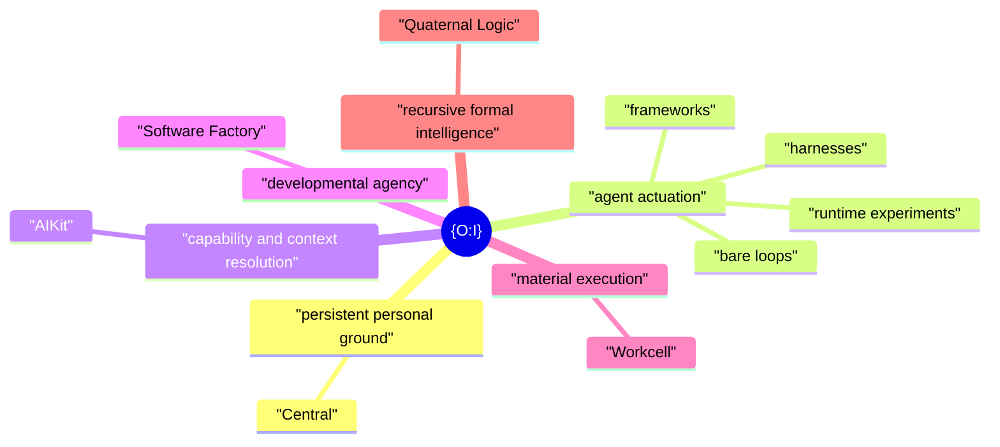

# {O:I}

**Operating Infrastructure · Objective Internality**

{O:I} is an open idea and architecture for the **provisioning and potentiation of technological agency around available model capacity**.

A model supplies capacity. An agent loop puts some of that capacity into motion. What that act can become depends on the world around it: where it stands, what it can reach, what it can do, what it can know, which projects it inhabits, which machines it can use, and how its work can persist and develop.

{O:I} names that wider field.

## An architecture for the engineering around the model

A large part of contemporary AI engineering begins after the model already exists.

Engineers can change the loop that invokes it, the context it receives, the knowledge it can retrieve, the tools and Actions it can use, the projects it inhabits, the environments it can enter, the machines it can reach, and the developmental structures through which its work accumulates.

That is the field {O:I} is concerned with.

> **Given available model capacity, what technological structures provision and potentiate useful forms of agency?**

This gives a common frame to the systems that surround an acting model and shape what it can become in practice.

The smallest case is simple: **a durable personal working ground plus an LLM running in a loop**. The same architecture can open outward into richer capability, knowledge, development, execution, and recursive intelligence without changing that basic relation.

## Operating Infrastructure · Objective Internality

The name has two readings.

**Operating Infrastructure** is the technical reading: the structures through which an artificial actor can operate.

**Objective Internality** names the same field from the side of the actor. Much of an agent's effective interior world can exist outside the model as objective, inspectable structure — files, projects, capabilities, histories, sources, environments — and still be disclosed back into the act as its working horizon.

There is also a small joke in the name: **“Oh. I.”** Orientation matters. A useful agentic environment helps both human and artificial actors understand where they are, what is available, and what can happen from here.

At a deeper level, `{O:I}` also carries `0/1`: persistent ground and actuation, the minimal pair from which the wider architecture develops.



## The field

The present {O:I} family has six centres. Each can stand on its own. Together they describe a broad working field for technological agency.

| Function in the whole | Project | What it opens |
|---|---|---|
| Persistent personal ground | [**Central**](https://github.com/EpiLogos/Central) | Human-authored control, projects, machine intent, and a durable place from which agents can work. |
| Agent actuation | [**Agent Runtime experiments**](https://github.com/EpiLogos/agent-system-design/issues/94) | The LLM in act, from bare loops through frameworks and harnesses. |
| Capability and context resolution | [**AIKit**](https://github.com/EpiLogos/ai-kit) | The agent-use layer for tools, skills, Actions, sources, models, sessions, and context. |
| Developmental agency | [**Software Factory**](https://github.com/EpiLogos/agent-system-design) | Durable project development through Runs, Agents, evidence, candidates, and reusable patterns of work. |
| Material execution | [**Workcell**](https://github.com/EpiLogos/Workcell) | The computational worlds in which agency becomes materially situated and executable. |
| Recursive formal intelligence | [**Quaternal Logic**](https://github.com/EpiLogos/QL-MEF) | The formal and semantic research layer for recursive reasoning, refraction, and deeper structural experiment. |

Together they form a possibility space rather than a fixed workflow. A useful {O:I} can be very small, and it can grow as new needs appear.

## A personal architecture

{O:I} is aimed toward personal technological agency.

A user can begin from a common working shape and make it their own through ordinary authored files, projects, preferences, machine declarations, tools, sources, and histories. The centre can remain personal even when computation extends to another machine, a home server, an isolated environment, or remote compute.

Existing projects belong in this picture too. A repository can be adopted into the personal working ground while keeping the continuity that made it the same project in the first place.

## From a local world to a shared field

The same parent position gives {O:I} a future relational role.

A local installation can selectively project something it owns — a participant root, document, wiki object, research finding, project output, experiment, or another typed object — so that another human, Agent, O:I instance, or shared service can encounter it. The source object remains owned by its native system. {O:I} supplies the shared disclosure, addressing, projection, and transport seam across the products.

This adds another useful reading of the parent relation:

```text
0       /       1
Self   relation  Other
local  projection encounter
```

It does not add a seventh product. It describes the portal through which differentiated local worlds can become related without being collapsed into one centrally owned world.

The first browser surface is intentionally minimal: [`site/index.html`](site/index.html) contains only the `{O:I}` mark and a GitHub link. It establishes the site as an owned projection surface before there is anything worth pretending to host. The next functional step is a sparse Participant Root projected from explicitly public parts of a local Central setup.

The longer path is local-first and transport-independent. A future Epi-Logos service can make these relations live and subscribable, with SpaceTimeDB as the planned hosted implementation candidate, while the O:I projection and participation contracts remain independent of that transport and store.

## Open primitives

The surrounding projects have converged on a useful family of open abstractions: `Project`, `Context`, `Agent`, `Agency`, `Capability`, `Action`, `ContextSource`, `Run`, `Artifact`, `Claim`, `Evidence`, `Candidate`, `Environment`, and others.

Their value is practical. They give humans and agents stable handles on recurring parts of the agency problem while leaving room for different models, harnesses, providers, and deployments.

{O:I} provides the larger view in which these abstractions can be seen together.

## `oi`

`oi` is the simple entry command for the composed system.

It helps a human or agent set up {O:I}, see what is available, enter the documentation, adopt existing projects, and reach the command surfaces of the installed projects through one memorable namespace.

For example:

```text
oi ctrl ...
oi kit ...
```

The same projects can still be used directly. `oi` gives the composed system one shared doorway.

## Research

{O:I} is also a research proposal.

It gives us a practical way to study the engineering space around a fixed or available model: change the runtime, context, capability field, knowledge horizon, project structure, developmental process, or material environment, and observe what changes in effective agency.

The current agent-runtime experiments already test one part of that space by comparing different loop structures while separating them from the model and host that carry them.

The research programme also needs to learn from the field itself. [`docs/RESEARCH-PROTOCOL.md`](docs/RESEARCH-PROTOCOL.md) defines a repeatable path from discovering a real paper or system, through source-locked study and abstraction, into implementation, experiment, and a durable finding that can return to the shared knowledge field. Source claims, implementation facts, observations, and {O:I} interpretations stay distinguishable throughout that process.

The future O:I Wiki is therefore planned as a living research commons over technologies, papers, studies, abstractions, experiments, findings, questions, and dialogue rather than as a second rendering of these repository docs. Its implementation follows the generic Wiki system; its shared projections follow the local-first field described in [`docs/SHARED-FIELD.md`](docs/SHARED-FIELD.md).

The philosophical idea of **Objective Internality** opens the same question at another depth. Contemporary agent systems make it possible for an actor's working interior to be partly externalised into durable technical objects, then re-entered as context, capability, memory, world, and orientation. A shared field extends the same structure intersubjectively: selected objective internalities can become objects of relation, learning, challenge, reproduction, and dialogue between differentiated human and artificial participants.

That gives the software architecture a direct relation to the wider Epi-Logos and Antikythera research programme without making that background a prerequisite for using the technology.

## Start here

This repository is the shared front door for the idea and the composed installation.

- [`docs/VISION.md`](docs/VISION.md) — founding vision and research frame.
- [`docs/SURFACES.md`](docs/SURFACES.md) — the six project surfaces from the outside in.
- [`docs/ARCHITECTURE.md`](docs/ARCHITECTURE.md) — the composition architecture.
- [`docs/SHARED-FIELD.md`](docs/SHARED-FIELD.md) — local-first projection, participation, transport, and the future shared relational field.
- [`docs/RESEARCH.md`](docs/RESEARCH.md) — the agency-potentiation research programme.
- [`docs/RESEARCH-PROTOCOL.md`](docs/RESEARCH-PROTOCOL.md) — how humans and agents study real systems and return what they learn.
- [`docs/CLI.md`](docs/CLI.md) — the `oi` command surface.
- [`docs/INSTALL.md`](docs/INSTALL.md) — installation and composition.
- [`docs/MIGRATION.md`](docs/MIGRATION.md) — adopting existing projects.
- [`site/index.html`](site/index.html) — the minimal browser front door and future projection root.
- [`skills/oi/SKILL.md`](skills/oi/SKILL.md) — agent-facing orientation to the whole.