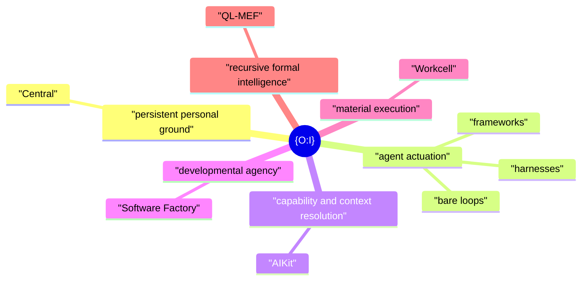

# {O:I}

**Operating Infrastructure · Objective Internality**

{O:I} is an open idea and architecture for the **provisioning and potentiation of technological agency around LLM capacity**.

A model supplies capacity. An agent loop puts some of that capacity into motion. What that act can become depends on the world around it: where it stands, what it can reach, what it can do, what it can remember, which projects it inhabits, which machines it can use, and how its work can persist and develop.

{O:I} names that wider field.

The name has two readings. **Operating Infrastructure** is the technical reading: the structures through which an artificial actor can operate. **Objective Internality** is the philosophical reading: much of an agent's effective interior world can exist outside the model as objective, inspectable structure and still be disclosed back into the act as its working horizon.

The idea is intentionally larger than any one agent runtime and lighter than a seventh operational product. It is the form that lets a family of independently useful systems become intelligible together.



The minimum useful case is small: **a durable personal working ground plus an LLM running in a loop**. The larger system can add capability resolution, knowledge navigation, durable developmental processes, remote or isolated execution, and deeper formal machinery without changing that basic relation.

## The field

| Function in the whole | Current surface | What it contributes |
|---|---|---|
| Persistent personal ground | **Central** | Human-authored control, projects, machine intent, and a stable place from which agents can work. |
| Agent actuation | **Agent Runtime** | The actual LLM loop. It may be a bare loop, framework agent, coding harness, or another runtime. |
| Capability and context resolution | **AIKit** | The agent-use layer for tools, skills, Actions, ContextSources, profiles, sessions, models, and harnesses. |
| Developmental agency | **Software Factory** | Durable Projects, Runs, Agents, evidence, candidates, and reusable patterns of development. |
| Material execution | **Workcell** | Workspaces, runtimes, services, containers, VMs, machines, and other material execution worlds. |
| Recursive formal intelligence | **QL-MEF** | Executable QL/MEF relations, refraction, and the deeper research layer through which the field can inspect its own form. |

These are product boundaries, not six steps that every task must traverse. Each system keeps its own native interface and can be used independently.

## `oi`

The {O:I} repository stays deliberately sparse. Its software surface is a small `oi` command that makes the whole easy to disclose, install, and enter.

When modules are installed through {O:I}, `oi` can provide a common namespace over their existing command surfaces. A native installation keeps its native CLI. A composed installation can also expose clean aliases such as:

```text
oi ctrl ...    # the personal-ground / project-control surface
oi kit ...     # the capability and context surface
```

The alias layer must not duplicate module behaviour. It should resolve the installed surface, hand off arguments, and keep the system legible to both humans and agents. The exact namespace for every module will be fixed from the native CLIs rather than invented here.

The other direct responsibilities of `oi` are intentionally small: initial setup, module installation, system status, documentation, and entry into project migration or adoption.

## An architecture for the engineering around the model

{O:I} helps name a large engineering domain that sits outside actual model development.

Engineers may not change the base model, its training run, or its fundamental inference capacity. They can still change almost everything through which that capacity becomes useful agency: agent loops, context, retrieval, memory, skills, tools, Actions, interfaces, project structures, developmental procedures, sandboxes, machines, services, and knowledge systems.

That is the development space {O:I} is interested in.

The research question is direct:

> **Given available model capacity, which technological structures provision and potentiate useful forms of agency?**

This can be studied by holding the model fixed while changing the runtime, capability field, knowledge horizon, project structure, developmental process, or material environment. The current QL agent-runtime experiments are one controlled way to study the runtime part of that field.

## Personal by construction

The centre of a full {O:I} installation is personal, even when its computation is distributed.

A user can begin from a common directory shape and make it their own through ordinary authored files, projects, preferences, and machine declarations. Their agents may then operate locally, on a home server, inside a Workcell, or through remote compute without turning physical placement into personal identity.

Existing projects should be adoptable. Moving a repository into the personal work tree must preserve the Project and its history rather than pretend a new Project was created.

## Open primitives

The surrounding products already converge on a useful set of open primitives: `Project`, `Context`, `Agent`, `Agency`, `Capability`, `Action`, `ContextSource`, `Run`, `Artifact`, `Claim`, `Evidence`, `Candidate`, `Environment`, and `Workcell` among them.

{O:I} does not own these abstractions. It makes their larger relation easier to see. Their value is that they give humans and agents stable handles on recurring parts of the agency problem without fixing one model, harness, provider, or deployment as the answer.

## Start here

This repository is the shared front door. It contains the vision, the map of the product family, the installation and migration design, the agent-facing {O:I} skill, and the small CLI that composes installed surfaces.

The deeper work remains in the products themselves.

See:

- [`docs/VISION.md`](docs/VISION.md) — the full founding vision and research frame.
- [`docs/ARCHITECTURE.md`](docs/ARCHITECTURE.md) — product boundaries and the sparse {O:I} layer.
- [`docs/CLI.md`](docs/CLI.md) — the `oi` namespace, installation, disclosure, and handoff model.
- [`docs/RESEARCH.md`](docs/RESEARCH.md) — the agency-potentiation research programme.
- [`skills/oi/SKILL.md`](skills/oi/SKILL.md) — agent-facing orientation to the whole.
