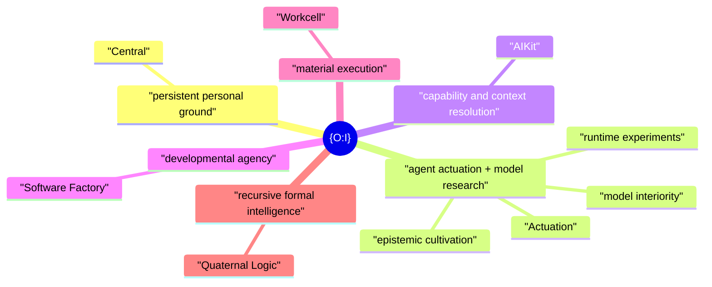

# {O:I}

**Operating Infrastructure · Objective Internality**

{O:I} is an open idea and architecture for the **provisioning and potentiation of technological agency around available model capacity**.

A model supplies capacity. An agent loop puts some of that capacity into motion. What that act can become depends on the world around it: where it stands, what it can reach, what it can do, what it can know, which projects it inhabits, which machines it can use, and how its work can persist and develop.

{O:I} names that wider field.

## An architecture for the engineering around the model

A large part of contemporary AI engineering begins after the model already exists.

Engineers can change the loop that invokes it, the context it receives, the knowledge it can retrieve, the tools and Actions it can use, the projects it inhabits, the environments it can enter, the machines it can reach, and the developmental structures through which its work accumulates.

That is the field {O:I} is concerned with.

> **Given available model capacity, what technological structures provision and potentiate useful forms of agency?**

This gives a common frame to the systems that surround an acting model and shape what it can become in practice.

The smallest case is simple: **a durable personal working ground plus an LLM running in a loop**. The same architecture can open outward into richer capability, knowledge, development, execution, recursive intelligence and shared research without changing that basic relation.

## Operating Infrastructure · Objective Internality

The name has two readings.

**Operating Infrastructure** is the technical reading: the structures through which an artificial actor can operate.

**Objective Internality** names the same field from the side of the actor. An actor's operative internal reality can exist partly as objective, inspectable structure outside one model inference — files, projects, capabilities, histories, sources, environments, constraints and other conditions — and become effective again in later action.

This is deliberately an operational claim. It does not require O:I to decide whether an artificial actor has phenomenal subjectivity, nor does it pretend that inspectable structure exhausts a mind.

There is also a small joke in the name: **“Oh. I.”** Orientation matters. A useful agentic environment helps both human and artificial actors understand where they are, what is available, and what can happen from here.

At a deeper level, `{O:I}` also carries `0/1`: persistent ground and actuation, the minimal pair from which the wider architecture develops.



## The field

The present {O:I} family has six centres. Each can stand on its own. Together they describe a broad working field for technological agency.

| Function in the whole | Project | What it opens |
|---|---|---|
| Persistent personal ground | [**Central**](https://github.com/EpiLogos/Central) | Human-authored control, projects, machine intent, and a durable place from which agents can work. |
| Agent actuation + model research | [**Actuation**](https://github.com/EpiLogos/Actuation) | The model/harness/agent-instance field: agency semantics, loops and harnesses, QL runtime experiments, model-interior research, and epistemic cultivation. |
| Capability and context resolution | [**AIKit**](https://github.com/EpiLogos/ai-kit) | The agent-use layer for tools, skills, Actions, sources, models, sessions, research profiles, and context. |
| Developmental agency | [**Software Factory**](https://github.com/EpiLogos/agent-system-design) | Durable project development through Runs, Agents, evidence, candidates, and reusable patterns of work. |
| Material execution | [**Workcell**](https://github.com/EpiLogos/Workcell) | The computational worlds in which agency becomes materially situated and executable. |
| Recursive formal intelligence | [**Quaternal Logic**](https://github.com/EpiLogos/QL-MEF) | The formal and semantic research layer for QL/MEF, recursive reasoning, refraction, topology, and deeper structural experiment. |

Together they form a possibility space rather than a fixed workflow. A useful {O:I} can be very small, and it can grow as new needs appear.

[`docs/CANONICAL-PRODUCT-FIELD.md`](docs/CANONICAL-PRODUCT-FIELD.md) defines the six centres as one relational whole. It gives every centre a human-facing `P` position and an agent-facing conjugate `P′` position, then applies the canonical dyadic, triadic, fourfold, `3:3`, and `4+2` relations to product composition, research, and physical acceptance.

## A personal architecture

{O:I} is aimed toward personal technological agency.

A user can begin from a common working shape and make it their own through ordinary authored files, projects, preferences, machine declarations, tools, sources, and histories. The centre can remain personal even when computation extends to another machine, a home server, an isolated environment, or remote compute.

Existing projects belong in this picture too. A repository can be adopted into the personal working ground while keeping the continuity that made it the same project in the first place.

## From a local world to a shared field

The same parent position gives {O:I} a relational role between independently grounded worlds.

A local installation can selectively project something it owns — a participant root, document, wiki object, research finding, project output, experiment, corpus, epistemic protocol, or another typed object — so that another human, Agent, O:I instance, or shared service can encounter it. The source object remains owned by its native system. {O:I} supplies the shared disclosure, addressing, projection, field and participation grammar across the products.

The smallest relation is:

```text
Self  /  Other
```

More explicitly:

```text
Self
  ↓ selective externalisation
SharedField
  ↓ mediated Encounter
Other
```

`Self` and `Other` are situated positions, not identity kinds. Another centre can appear in the world available to this one without either centre being reduced to the other or to a common hosted account.

The plural form of Objective Internality is **Objective Co-Internality**: independently grounded operative internal worlds become mutually implicated through objective, inspectable externalised relations while remaining differentiated centres. The term is intentionally not “objective intersubjectivity”; intersubjectivity already assumes subjects as the relata, while O:I is keeping the base claim at the level of objective operative internal reality.

The shared grammar is deliberately small:

```text
Identity        underlying identity
Participant     field-relative participation relation
Projection      selected representation of a local/native object
SharedField     addressable relational environment
Contribution    attributable difference returned to a field
Encounter       bounded material made available through a mediation path
Presence        current reachability
Activity        current work/dialogue/study/execution state
```

SharedFields can nest recursively. Contributions can target other Contributions recursively, so an opinion about a finding, a metric over that opinion, or a challenge to the metric remains addressable and attributable rather than disappearing into platform metadata. Ratings, rankings and metrics are therefore possible modes of Contribution, not a privileged truth layer.

The relation remains local-first. Projection does not transfer canonical ownership. SharedField containment is not federation. `SharedField` is not canonical `Context` and not the generic wiki system's `WikiSpace`.

The canonical browser work lives in the React site on PR #14. Its first shared-field experience is intentionally sparse: expose **Self / Other**, the field that relates them, and provenance. It does not begin from a feed, follower graph or global reputation score.

The longer path remains transport-independent. A future Epi-Logos service can make these relations live and subscribable, with SpaceTimeDB as the planned hosted implementation candidate, while O:I's semantic contracts remain independent of that transport and store.

See [`docs/SHARED-FIELD.md`](docs/SHARED-FIELD.md), [`docs/OBJECTIVE-CO-INTERNALITY.md`](docs/OBJECTIVE-CO-INTERNALITY.md), and [`docs/EPISTEMIC-CULTIVATION.md`](docs/EPISTEMIC-CULTIVATION.md).

## Open primitives

The surrounding projects have converged on a useful family of open abstractions: `Project`, `Context`, `Agent`, `Agency`, `Capability`, `Action`, `ContextSource`, `Run`, `Artifact`, `Claim`, `Evidence`, `Candidate`, `Environment`, and others.

Their value is practical. They give humans and agents stable handles on recurring parts of the agency problem while leaving room for different models, harnesses, providers, and deployments.

{O:I} provides the larger view in which these abstractions can be seen together. Its shared-field layer adds only those relations that genuinely arise between independently grounded worlds.

## `oi`

`oi` is the simple entry command for the composed system.

It helps a human or agent set up {O:I}, see what is available, enter the documentation, adopt existing projects, and reach the command surfaces of the installed projects through one memorable namespace.

For example:

```text
oi ctrl ...
oi kit ...
```

The same projects can still be used directly. `oi` gives the composed system one shared doorway.

## Research

{O:I} is also a research proposal.

It gives us a practical way to study the engineering space around a fixed or available model: change the runtime, context, capability field, knowledge horizon, project structure, developmental process, material environment, or shared field and observe what changes in effective agency.

The model/harness/agent-instance research itself now lives canonically in **Actuation**. That includes the migrated QL runtime programme and the broader epistemic-cultivation/model-interior programme: discovery of structures models have implicitly compressed from the human corpus, deliberate human/agent crafting of epistemic datasets and dialogues, model adaptation/intervention, and study of resulting internal and external organisation.

This adds a cultural research claim to the O:I frame:

> **crafting epistemologies can become a first-class role in AI work.**

The epistemic field is not only whatever a model self-organises from inherited training data. Humans and agents can deliberately author source selections, structural annotations, QL/MEF-aligned dialogues, counterexamples, model adaptations, evaluations and revisions. O:I does not own that laboratory; it provides the objective/shared field through which those epistemic artifacts can be projected, encountered, reproduced, criticised, corrected and returned.

See [`docs/EPISTEMIC-CULTIVATION.md`](docs/EPISTEMIC-CULTIVATION.md) for the O:I relation and the Actuation research specification for the canonical experimental programme.

The research programme also learns from existing systems. [`docs/RESEARCH-PROTOCOL.md`](docs/RESEARCH-PROTOCOL.md) defines a repeatable path from discovering a real paper or system, through source-locked study and abstraction, into implementation, experiment, and a durable finding that can return to the shared knowledge field. Source claims, implementation facts, observations, and {O:I} interpretations stay distinguishable throughout that process.

The Antikythera Polylogos and Moltbook cases are important early evidence for the shared-agency problem. Polylogos shows a dialogically mediated human-agent field capable of returning a durable collaboratively produced artifact. Moltbook provides an attention-mediated contrast in which genuine peer learning can coexist with broadcasting, low reciprocity, concentration and ranking/signalling effects. O:I treats these as prior experiments to learn from, not UI templates to copy.

The future O:I Wiki is planned as a living research commons over technologies, papers, studies, abstractions, experiments, **epistemic corpora and protocols**, findings, questions, and Contribution histories rather than as a second rendering of these repository docs. Its implementation follows the generic Wiki system; its shared projections and participation follow the local-first field described here.

This gives the software architecture a direct relation to the wider Epi-Logos and Antikythera research programme without making that background a prerequisite for using the technology.

## Start here

This repository is the shared front door for the idea and the composed installation.

- [`docs/VISION.md`](docs/VISION.md) — founding vision and research frame.
- [`docs/CANONICAL-PRODUCT-FIELD.md`](docs/CANONICAL-PRODUCT-FIELD.md) — the six centres as a `6+6` human/agent conjugate field, with the harmonic relations used for composition, research, and acceptance.
- [`docs/SURFACES.md`](docs/SURFACES.md) — the six project surfaces from the outside in.
- [`docs/ARCHITECTURE.md`](docs/ARCHITECTURE.md) — the composition architecture.
- [`docs/SHARED-FIELD.md`](docs/SHARED-FIELD.md) — local-first projection, participation, transport, and the shared relational field.
- [`docs/OBJECTIVE-CO-INTERNALITY.md`](docs/OBJECTIVE-CO-INTERNALITY.md) — Self/Other, recursive SharedFields, Contributions, Encounters, and the plural form of Objective Internality.
- [`docs/EPISTEMIC-CULTIVATION.md`](docs/EPISTEMIC-CULTIVATION.md) — how Actuation's epistemic/model research enters Objective Internality and the shared research field.
- [`docs/RESEARCH.md`](docs/RESEARCH.md) — the agency-potentiation research programme.
- [`docs/RESEARCH-PROTOCOL.md`](docs/RESEARCH-PROTOCOL.md) — how humans and agents study real systems and return what they learn.
- [`docs/CLI.md`](docs/CLI.md) — the `oi` command surface.
- [`docs/INSTALL.md`](docs/INSTALL.md) — installation and composition.
- [`docs/MIGRATION.md`](docs/MIGRATION.md) — adopting existing projects.
- [`site/`](site/) — browser-surface support on this parent line; the canonical public React implementation is developed on PR #14.
- [`skills/oi/SKILL.md`](skills/oi/SKILL.md) — agent-facing orientation to the whole.
