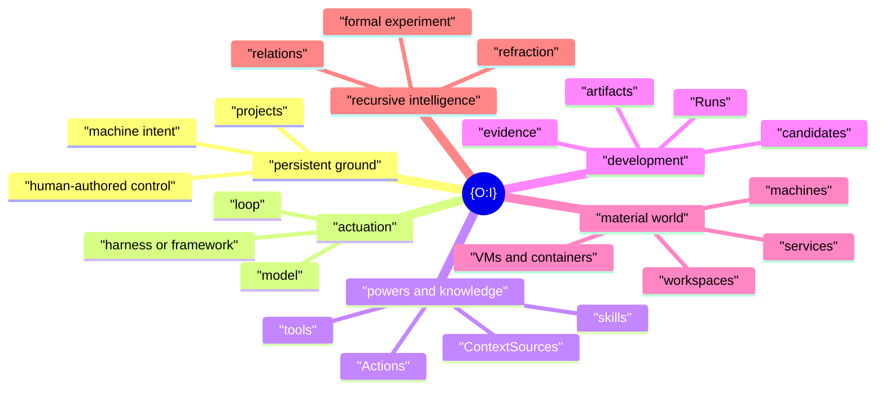

# {O:I} — Founding Vision

**Operating Infrastructure · Objective Internality**

{O:I} is an idea about the technological structure of agency.

It begins from a simple observation. A model can have great capacity and still have very little agency in a given situation. Capacity becomes useful through a surrounding structure: a place to stand, a context to enter, powers to use, knowledge to reach, projects to continue, environments to act in, and forms through which work can persist.

{O:I} names this surrounding field and gives it a coherent architecture.

The project is therefore concerned with the **provisioning and potentiation of agency**. Provisioning makes the conditions for action available. Potentiation increases what can become actual through those conditions. The distinction matters because many of the most consequential engineering choices around LLMs do not change the model itself. They change the world in which the model acts.

This gives {O:I} a clear object of design and research:

> **Given available model capacity, what technological structures make useful forms of agency possible?**

The answer can be small. A durable working directory and an LLM in a loop already form a basic case. The answer can also become rich. The same actor may gain projects, skills, Actions, knowledge sources, development systems, remote machines, isolated execution, persistent services, and recursive semantic machinery.

{O:I} is the Idea that holds these cases together.

## The field before the products

The architecture is easiest to understand from the functions that agency needs.

An actor needs some **persistent ground**. There must be a durable place where human-authored context, projects, machine intent, and working conventions can remain available across invocations.

An actor needs **actuation**. Some model must be placed into a loop that can receive, act, observe, and continue. The loop may be minimal or elaborate.

An actor needs an **available field of powers and knowledge**. Tools, skills, Actions, sources, models, sessions, and project context must become discoverable and usable at the point of action.

An actor may need **developmental structure**. Work that spans design, implementation, evidence, candidates, decisions, and return should remain intelligible after one session ends.

An actor may need a **material world**. A task may require a workspace, service, container, VM, remote host, database, browser surface, or other execution environment.

An actor may also gain **recursive formal intelligence**. The structures through which it works can themselves become objects of interpretation, comparison, and further development.

The current product family implements these six centres:

| Function | Current implementation |
|---|---|
| Persistent personal ground | Central |
| Agent actuation | Agent Runtime |
| Capability and context resolution | AIKit |
| Developmental agency | Software Factory |
| Material execution | Workcell |
| Recursive formal intelligence | QL-MEF |

The names matter because each product has its own identity and full design. The functional descriptions matter first because {O:I} is about the wider technological field that these products currently instantiate.

The diagram is a field, not a pipeline. A task can touch two centres or all six. A person can install one module or the whole family. The relation is compositional rather than compulsory.

## Operating Infrastructure

The first reading of the name is technical.

**Operating Infrastructure** is the infrastructure through which an artificial actor can operate.

An operating system gives programs a world of files, processes, memory, devices, and permissions. Agentic systems now need another level of organisation around model inference. They need persistent projects, retrievable knowledge, capabilities, Actions, sessions, machines, environments, development history, and human-authored context.

These structures are often scattered across unrelated tools. {O:I} gives the field one point of orientation without requiring one monolithic implementation.

The aim is to make the underlying possibility space **open, extensible, manipulable, and legible to agents as well as humans**.

## Objective Internality

The second reading names the same architecture from inside the act.

A technological agent can depend on an internal world that is partly external to the model.

Its project can exist in files and graphs. Its available powers can exist as skills, commands, and schemas. Its memory can exist in stores. Its current machine state can exist as observations. Its prior decisions can exist in durable records. Its knowledge horizon can span repositories, documents, wikis, websites, and databases.

All of these structures are objective. They can be inspected independently of one model invocation.

Yet they can also be disclosed into the actor's working horizon and become constitutive of what the actor can understand and do.

This is **Objective Internality**: an internal world whose operative structures can be externalised, inspected, changed, and disclosed back into agency.

The concept gives a precise way to discuss a feature of current agent systems that is easy to miss when attention stays on the model alone. The technological interior of the act is not identical to the neural interior of the model.

## "Oh, I"

The name also carries a small human joke.

**Oh, I.**

An actor becomes more capable when the system can disclose where it is, what is available, and what matters now.

For a human, this means that the software family should be easy to understand as one field. For an agent, it means that the same field should be available through clear commands, skills, documentation, and machine-readable state.

The `oi` command exists for this reason. It is the front door through which the structure can disclose itself.

## 0/1

At the deepest level, `{O:I}` also reads as `0/1`.

The minimal technical pair is direct:

- `0`: a persistent place from which agency can stand;
- `1`: an actuated intelligence that can work from there.

The current product family gives these roles concrete forms through the personal ground and the agent runtime. The other four centres develop the field around that pair.

The fuller formal relation belongs to QL-MEF. {O:I} does not require that formal language for ordinary use. The point is that the technological architecture already has a natural minimal form before the deeper reading is applied.

## Personal agency and shared infrastructure

{O:I} has a personal centre.

This does not mean that all computation is local. It means that a person should be able to have a stable authored ground that remains theirs while models, machines, runtimes, and services change around it.

A common base can provide a default directory shape and standard conventions. The useful system then becomes personal through ordinary authorship: projects, preferences, tools, machine declarations, sources, and working practices.

The same personal ground can support local work, a home server, a remote VM, a cloud host, or future execution systems. Material placement can change without becoming identity.

This personal orientation has a second consequence. The system should increase human agency as it increases artificial agency. Better agentic infrastructure should remove repeated setup, context reconstruction, low-level orchestration, and other work that does not need human authorship. Human attention can then stay closer to purpose, judgement, taste, recognition, and consequential choice.

## An attractor for attention

{O:I} is also useful as an attractor for attention.

Human attention and compute attention now move through increasingly complex fields. The human moves among projects, choices, interfaces, results, and priorities. The model moves among prompts, context, tools, sources, actions, sessions, and environments.

A coherent architecture can reduce the friction between these movements.

The Idea does not need to control the whole field. It gives the field a centre of intelligibility. A person can see where a need belongs. An agent can discover which surface can satisfy it. A developer can decide which product owns a new capability. A researcher can isolate which part of the surrounding structure changed a result.

This is why {O:I} can remain sparse while still being meaningful.

## The open grammar of agency

The surrounding systems already use abstractions that recur across agentic work: `Project`, `Context`, `Agent`, `Agency`, `Capability`, `Action`, `ContextSource`, `Run`, `Artifact`, `Claim`, `Evidence`, `Candidate`, `Environment`, and `Workcell`.

These abstractions do not belong to {O:I} as a new ontology. They are examples of a useful design principle.

A strong primitive creates a stable handle without fixing one implementation.

A Project can survive a path change. A Capability can be provided by many technologies. An Action can expose one domain operation to human and agent surfaces. A ContextSource can make very different knowledge systems available through one navigable relation. A Workcell can satisfy execution needs through different providers.

This is the kind of architecture {O:I} seeks to gather: strong seams, open implementations, and enough shared language to make the field manipulable.

## An engineering field around model capacity

A large part of current AI engineering takes place outside actual model development.

An engineer may not change the base model, training corpus, optimisation process, or fundamental inference architecture. The engineer can still change the agent loop, context assembly, retrieval strategy, memory, capabilities, Actions, human interface, project structure, knowledge system, development process, sandbox, machine topology, and execution environment.

These choices can materially change what the same model can accomplish.

{O:I} treats that development space as a first-class engineering field. Its object is not simply the agent implementation. Its object is the **technological structure through which model capacity becomes situated agency**.

This creates a useful separation:

**Model development** changes underlying capacity.

**Agency engineering** changes the structures that provision and potentiate the use of that capacity.

The boundary is not absolute. Training, fine-tuning, model adaptation, and post-training systems can meet the same environment. The distinction is still useful because it gives engineers a clear field to study when the underlying model is held fixed.

## Research programme

The architecture therefore supports a direct research programme.

Hold model capacity constant where possible. Change one part of the surrounding agency structure. Observe what changes in the act.

The variables can include runtime recurrence, capability availability, knowledge horizon, persistent project context, developmental structure, material environment, or deeper semantic machinery.

The observations can include task completion, orientation, recovery, restraint, tool use, context efficiency, human intervention, cost, latency, and quality of evidence.

The current agent-runtime experiments are an important example because they isolate the loop itself. A rich harness, a framework agent, and a comparatively bare host can run against matched conditions. Classic and QL recurrence can then be compared without treating model capacity as the only variable.

This research does not need to prove one universal architecture. It can map where different forms of infrastructure help, where they add friction, and where the underlying model remains the dominant constraint.

The speculative claim is therefore directed and testable:

> **There is a structured engineering space between model capacity and effective agency, and that space can be made explicit enough to design, compare, and improve.**

## Relation to the wider philosophical work

Objective Internality also gives the software a clear relation to the wider philosophical research.

The software provides a contemporary technical object in which interiority, externalisation, memory, world, agency, representation, and self-relation meet in concrete form. The philosophical work can develop those relations at their own level. The software can test what happens when related abstractions are given executable form.

QL-MEF provides the deeper formal research surface for this work. Epi-Logos names the fuller configuration in which that formal structure and its associated semantic resources become active within the wider system.

This relation should remain proportionate. A person does not need the philosophical account to use {O:I}. The philosophy matters because it has helped generate abstractions and research questions that can also stand in technical language.

## Encounter

A new user should not have to understand the whole system before they can begin.

They should be able to encounter one clear proposition:

> Modern agents depend on more than a model and a loop. {O:I} is an open architecture for the wider field through which model capacity becomes situated agency.

They can begin with a personal ground and any agent runtime. They can add capability resolution when they need a richer agent-use layer. They can add the developmental system when work needs durable project and Run structure. They can add material execution when local process boundaries are no longer enough. They can add QL-MEF when they want the deeper formal and recursive layer.

The same principle applies to agents. An agent should be able to clone this repository, read one skill, inspect the installation, and understand which native surface should handle the next operation.

That is the experience the `oi` command and this repository are here to provide.

## Character

{O:I} should remain simple enough to see and deep enough to grow through.

It should be open to new models, runtimes, providers, and applications. It should be personal without becoming opaque. It should make meaningful operations available to agents without reducing human experience to machine interfaces. It should state speculative ideas clearly and test them through working systems.

Most of all, it should preserve the difference between the **Idea of the whole** and the products that make parts of that Idea concrete.

The products do the work.

{O:I} lets the field appear.
