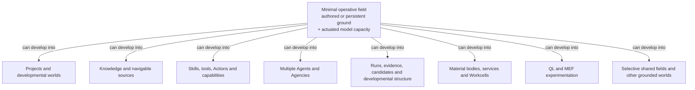
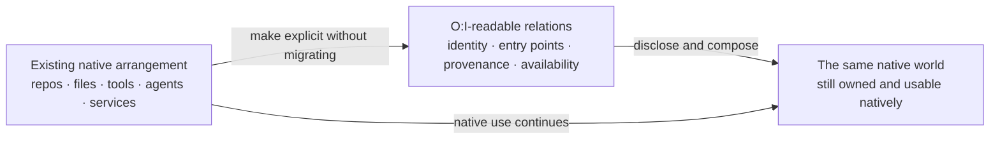
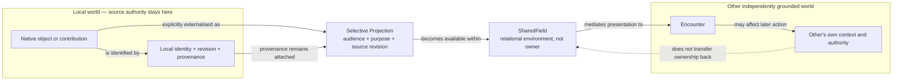
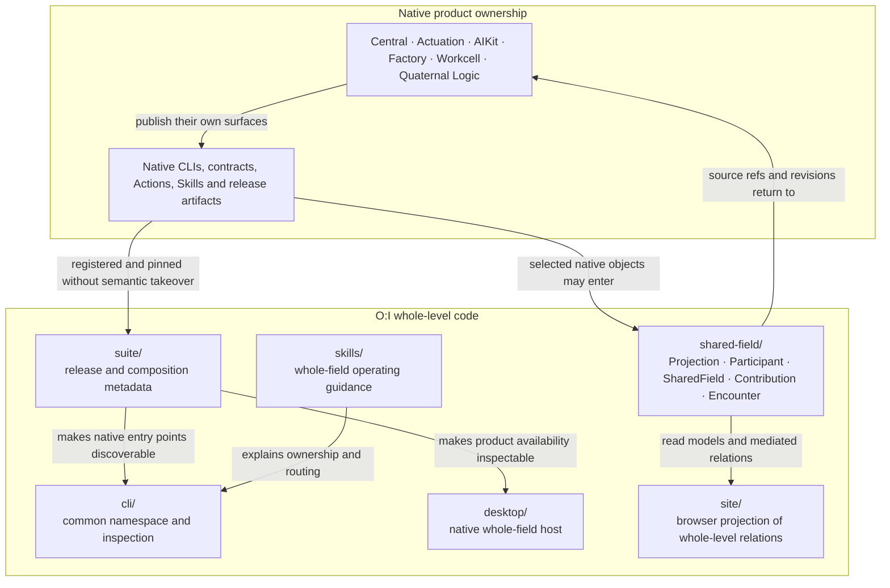

# {O:I} Visual Product Understanding

**Status:** canonical product-understanding surface  
**Architecture status:** describes accepted `main`; open PRs are named only as developmental sources  
**Authored source:** `docs/positions/FOUNDING-POSITIONS.md` on draft PR #71, read together with `CANONICAL-PRODUCT-FIELD.md`, `ARCHITECTURE.md`, `OBJECTIVE-CO-INTERNALITY.md`, and accepted first-suite implementation.

This document gives three visual depths different jobs. Experience shows what changes for a person or agent. Product relation shows what O:I makes possible without absorbing native ownership. Architecture shows the accepted software seams which currently realise those relations.

## 1. Experience — one field can remain minimal or develop outward

The minimum is not an incomplete six-stage pipeline. A useful O:I world can begin with durable authored ground and model capacity that can be actuated. Everything else develops the possibilities of that same field when it is wanted.

The arrows mean **optional development of available possibility**, not installation order, ontological dependence, or a claim that every O:I world needs every product surface.

### Existing worlds are the starting fact

O:I is successful here when explicit composition adds intelligibility without requiring the person to abandon the heterogeneous world they already have.

## 2. Product / conceptual relation — projection without world capture

The essential relation is not “upload into a global world”. It is **one grounded world making a selected difference available to another while the SharedField preserves alterity, provenance, and local authority**.

## 3. Architecture — accepted current seams

This diagram describes the accepted repository shape on `main`, not the separate Explore implementation on draft PR #72.

Current implementation therefore has two thin operative faces: **local suite composition/disclosure** and **whole-level shared-field relation**. Neither is a seventh implementation of the native products.

## 4. Diagram audit

| Existing visual | Class | Disposition |
|---|---|---|
| `CANONICAL-PRODUCT-FIELD.md` twelve-face and harmonic relation maps | specialist conceptual/formal | **Preserve.** They explain the QL reading of the six-product field, not ordinary first-contact product meaning. |
| `ARCHITECTURE.md` native world → O:I → SharedField → Other | conceptual | **Superseded for first explanation** by the provenance-bearing projection diagram above; keep the deeper prose and specialist shared-field relations. |
| `ARCHITECTURE.md` Objective Co-Internality ASCII circuits | specialist conceptual | **Preserve.** They develop Self/Other implications beyond the minimum product diagram. |
| `OBJECTIVE-CO-INTERNALITY.md` relation diagrams | specialist conceptual/research | **Preserve.** Do not promote them into implementation architecture. |
| suite/security diagrams and receipts | architectural/evidence | **Preserve where local.** They prove specific mechanisms rather than explain the product as a whole. |

One known drift is corrected with this visual pass: `ARCHITECTURE.md` must name **Actuation**, not the older `Agent Runtime`, as the current product centre.

## 5. Verification

**Semantic:** none of the diagrams requires the reader to know the six internal product nouns before understanding why O:I exists. Important arrows name development, explication, projection, mediation, provenance, or native continuation.

**Implementation:** the architecture diagram names only accepted repository seams present on `main`. Draft PR #71 is used as authored-position provenance; draft PR #72 is not presented as current architecture.

**Cross-product:** the diagrams deliberately do not turn the six native products into one pipeline. O:I composes and discloses the field while the products retain their own semantic centres.

## 6. Public-site projection

The later public-site session should **reinterpret**, not duplicate, the first two diagrams:

- project the minimal→maximal field as a spatial opening of optional possibility rather than a product carousel;
- project existing-world→O:I-readable-world as the reason heterogeneous native arrangements can enter without migration;
- use the local-world→Projection→SharedField→Other relation as the conceptual basis for Explore.

The architecture diagram belongs in technical documentation and an inspectable “how it works” layer, not on the first public encounter.