# How does source become an agent's context?

AIKit maintains an index and resolves the actor's Project, Profile, Focus and
scope against available sources. SourcePool retrieval, SemanticWiki meaning,
code-index structure, capability descriptions and praxis have distinct owners.
The native knowledge route searches/resolves/reads them with provenance. A
matrix `architecture_refs` or `diagram_refs` relation makes a document
discoverable; it does not establish implementation or silently load its body.

Skill, Method and Methodology share a praxis identity but carry different
description forms. A SkillSet is a selection/package relation, not a combined
body and not an authority grant. Resolve and read the selected revision before
using its practice. ContextResolution describes what was selected and why;
hook/adaptor delivery must separately prove what entered the harness.

The current Wiki operational projection is selected by declared source address.
AIKit rereads its bytes/revision, wraps them as attributed operational context
and delivers through the chosen hook/encounter path. Revision-checked native
correction updates that projection and ledger; it does not rewrite governance.
NOW context uses selected native refs/revisions and hot Redis continuity where
available. Redis is a cache; Central and the independently owned sources remain
authoritative. Saved → selected → emitted → observed use are separate claims.

| Operation | Owner/source | Lifecycle and proof |
| --- | --- | --- |
| `aikit knowledge search/resolve/read/route/explain/history` | AIKit knowledge providers and resolver | Provider authority and warnings retained; missing Wiki child is a failure, not empty knowledge. |
| `aikit praxis read` / resolution | `crates/aikit-core/src/praxis.rs`, `agent_praxis.rs`, `context_resolution.rs` | Identity/revision, form and selected scope; consult `docs/PRAXIS-ARCHITECTURE.md` and `docs/v2/`. |
| `aikit wiki projection read/update` | `crates/aikit-cli/src/wiki_projection.rs` | Exact expected revision, durable correction ledger, next delivery names actual source hash. |
| Native hook and encounter admission | `crates/aikit-adapters/src/hook_sources.rs`, `crates/aikit-cli/src/encounter_service.rs` | Selected source/adaptor receipts; `apply_hook_seam.rs`, `hook_stdout_inject.rs`, `encounter_context_admission.rs`, `now_context_encounter.rs`. |

The initial root Wiki query failed with
`knowledge.wiki_space_missing_child` for `central:wiki:project:Actuation`.
Direct native source reads worked and inspection proceeded after that recorded
faculty failure. A later native search on 1 October succeeds with explicit
warnings: missing `epi` and `legacy` child targets are dropped from the read
index, SourcePool and code search are degraded, the Central product query
reports no `World Central` and falls back to root lineage, and 36 unresolved
targets remain in that primary reading. A product repository is distinct from
the person's World; this warning does not commission a new personal World
named Central. This no longer reports the earlier fatal Actuation failure; it does
not prove every Wiki/World relation repaired. C9 preserves the latest observed
warning, not a designed omission or an empty-knowledge result.

Native `aikit praxis list` and `aikit search architecture-authoring` resolve
the Central practices as revisioned `skill/central/...` capsules. Matrix
praxis links identify those capsules; they do not claim the practice has been
selected or used in a later encounter.

Arrow bases C1–C9 are in [relations.json](relations.json). The existing
[praxis/document programme](../../.wayfinder/maps/agent-praxis-document-world.md)
governs the desired shape; this companion records the inspected delivery cuts.
