# How does commissioned work return?

A Commission states authorised work and its conditions. Factory carries the
situated participant, actual execution body, selected source/praxis, material
protection, effects, budget, verification obligations and return address into
an attempt. Custody identifies who currently owes a bounded work concern;
it is not Agent identity, a resident process, a NOW folder or Run ancestry.
Actuation occupancy supplies the current Position/generation used by custody
gates. A custody handoff records its successor in the same native transaction.

Factory's attempt journal and coordinator metadata share the developmental
store lock. Workcell's Run ledger records material execution and collection;
AIKit owns the native encounter resident, canonical session and delivery
journal. These identities are linked explicitly by the execution disposition.
An agent's output is proposed work/evidence, not a verified outcome by naming.

VerificationReceipt records its verifier owner, outcome, obligations and
evidence refs. `sourceRevision` can name the **evidence owner's source** (for
example an AIKit journal); it must not be universally interpreted as the
candidate tree revision. Applicability to an attempt also requires its own
identity and subject basis. Native review checks passed verification and
required obligations; receiving bridges submit/read back actual Central
receipts. A recorded receiving acknowledgement is not human Recognition.

| Operation to locate | Authoritative owner/source | Verification |
| --- | --- | --- |
| Assign/update custody | Factory `factory/src/work_custody.rs` | Current Actuation generation; atomic successor handoff tests. |
| Seed/prepare/operate an attempt | Factory `factory/src/attempt_runtime.rs`, `attempt_native_store.rs` | `factory/tests/attempt_public.rs`, `attempt_material.rs`, `attempt_place.rs`; actual native CLI/process cases. |
| Review verification / receive a result | Factory `attempt_review.rs`, `attempt_receiving.rs` | Passed evidence/obligation tests, native Central follow-up and receiving cases. |
| Present human Return | O:I Factory/Flow Surfaces and Central receiving/Flow source | Read native receipt and presented artifact; human acceptance remains a distinct act. |

**Repaired bounded defect:** the installed baseline `18682ee` left a rejected
leg `Returned`. Factory's published repair `dd0765dd9596086e14ce7bef8d604759cc8daf8f`
invalidates the current Return on a latest Failed/Unknown verification, and
retains outdated output as history after a subject advance. R10 names that
implemented rejection relation. The independent native replay passed 10/10
controls against the baseline's 7/10; its exact binary, source digest, cases
and evidence refs are retained in [the bounded proof](evidence/factory-rejection-currency.json).
The repair lane also reports managed Mac and Omarchy replay; that report does
not prove the later whole-Run work.

The red box preserves the remaining acceptance boundary: required whole-Run
completion, receiving, controlled decisions, source-seat handover and participant
replacement need their own native results. Coordinator fencing and Workcell
task admission are different mechanisms. A writable directory binding was
accepted but `run scope` refused it because that path only recognised a Git
worktree; the native Workcell owner is repairing it. No unproved diagram arrow
fills that join.

See R1–R10 in [relations.json](relations.json). Factory's existing
`docs/program/BOUNDED-AGENCY-FOUNDATION.md` and companion
`bounded-agency-circuit.mmd` describe a narrower dated native circuit; they do
not prove the whole Commission/Flow programme or human governance adoption.
