# How do local NOWs participate in shared Expressions?

Central owns each local Workcell-root NOW and bounded child NOW; personal Day
policy and open work lifecycles remain local. Workcell supplies material
identity and Run/service facts. AIKit uses the selected native refs for current
actor continuity. A SharedField does not mount a person's NOW directory or
rewrite their civil Day.

O:I's `field-now.mjs` validates a selected `oi.field-now/v1` / FieldDay
projection: native source refs/revisions, attributed publisher, field/world
identity and explicit audience. Local paths, transcripts, tokens and gateway
internals are refused. Projection revision CAS and reconnect reconciliation
belong to the shared carrier. Shared field temporal policy is distinct from
the publisher's local civil policy. Source Day references are qualified by
World and Workcell when supplied; identical local Day spellings in two Worlds
must not collapse into one entry. A legacy ambiguous string withdrawal is
refused rather than guessing its source. Participant-context admission checks
current field authority and latest available projection; revoked, expired or
withdrawn material does not become agent context merely because it was cached.

The retained native Expression is a different resource. Its publication
filters selected scenes, entities, admitted material and safe subject/source
refs **before** serialization. Projection, presentation and Expression
revisions remain separate. SpaceTimeDB subscribers revalidate indexed
semantic refs against source contracts; implementation row IDs remain metadata.
Live rendering consumes the admitted composition, with an explicit frozen
fallback when the receiving renderer is unavailable.

**Current join under repair:** the shared undertaking is carrying an ordinary
installed Explore episode through publication, participant context and the
live renderer, preserving admitted Scene material via the existing native
conversion. The source carrier and validators exist; a complete installed,
independent participant episode is not yet returned at this cut. The dashed
join is desired integration/acceptance, not a claim of observed delivery.

| Boundary | Actual source | What to verify |
| --- | --- | --- |
| Local temporal source → selected FieldNow/FieldDay | Central continuous work; O:I `shared-field/field-now.mjs` | Native revisions, declared Workcell identity (not Run/service bodies), egress refusal, CAS, local/field Day separation. |
| Current shared reading → participant packet | `shared-field/participant-context.mjs` | Caller authority and withdrawal; omitted private bytes remain absent after serialization. |
| Native Expression → admitted composition | `shared-field/expression-projection.mjs`, `expression-material.mjs` | Selected scene material, source provenance and omission disclosure; no CSS-only filtering. |
| Hosted rows → Explore / renderer | `shared-field/spacetimedb.mjs`, `expression-presentation.mjs`, desktop consumer | Subscription/reconnect/stale reading, semantic identity and renderer/fallback; installed ordinary episode. |

S1–S9 are indexed in [relations.json](relations.json). Consume the
[Epi fidelity route](../EXPRESSION-WORLD-SUBSTRATE-WAYFINDER.md) for the
coordinate-bound world and Personal Pratibimba. A shared coordinate locus,
private person, current occasion and particular Expression are different
subjects. This diagram makes no new numerical or branch-domain determination.
