# Who owns the World?

Central owns the person's authored filesystem ground and temporal NOW/Day
state. The Central **product repository** is not that person's **World root**.
AIKit reads independently owned sources, resolves addressable resources and
praxis, and owns canonical encounter/session continuity. It does not acquire
authorship of those sources by indexing them.

Actuation owns attributable Agency, WorldBinding and Position occupancy.
Factory owns commissioned developmental work, custody and attempt lineage.
Workcell owns material placement, service instances and material Run records;
a Factory canonical Run ref is optional. QL-MEF owns formal operations and
domain structure, including the scene-world/source basis consumed by O:I.
These are contributing centres, not a compulsory execution pipeline.

O:I's native desktop composes owner readings into the kernel and Surfaces.
Retained Expressions/documents are resources, while Workspace/tab/focus state
is presentation continuity. SharedField stores an explicitly admitted,
audience-scoped projection with its own revision. A subscriber's cache is a
reading of that projection, not a copy of the publisher's private World.
This boundary makes withdrawal, provenance and caller-specific authority
meaningful; CSS visibility is not an egress policy.

| Locate this operation | Native source | Storage/lifecycle | Verification route |
| --- | --- | --- | --- |
| `central.world.here`, Position and Workcell-root NOW | Central `ctrl/src/world_here.rs`, `ctrl/src/continuous_work/placement.rs`; [World inhabitation](../contracts/WORLD-INHABITATION-V1.md) | Source-root definitions and idempotent temporal identities; personal Day policy does not close ongoing work. | Central `ctrl/tests/continuous_work_native.rs`; configuration/NOW repair return. |
| Claim/release/verify occupancy | Actuation `crates/actuation-stream/src/occupancy_store.rs` | Append-only generations; expected-vacant/current generation gates mutations. | Occupancy store tests, World inhabitation contract. |
| Read work custody and attempt state | Factory `factory/src/work_custody.rs`, `attempt_native_store.rs` | Native developmental transaction and lock; no second writable current-work registry. | Custody generation/handoff tests and attempt public tests. |
| Place, observe, collect and release material | Workcell `crates/workcell-runtime/src/run.rs` | Individual `runs/<slug>.json` records; `runs.json` is derived. CAS and shared lock prevent observation overwriting release. | `run_lifecycle.rs`; `records_survive_a_reconstructed_ledger_and_the_index_is_derived`. |
| Publish and consume an Expression | O:I `shared-field/expression-projection.mjs`, `spacetimedb.mjs` | Selection filter precedes serialization; semantic refs distinct from database row IDs. | Expression projection and hosted-source tests; [shared participation](shared-participation.md) names outstanding installed proof. |

See [relations.json](relations.json) W1–W11 for exact arrow bases. The Epi
domain's richer meanings remain in its [Wayfinder](../EXPRESSION-WORLD-SUBSTRATE-WAYFINDER.md)
and ongoing audit. Neither a WorldPresentation nor an Explore entry replaces
the coordinate-bound world or Personal Pratibimba.
