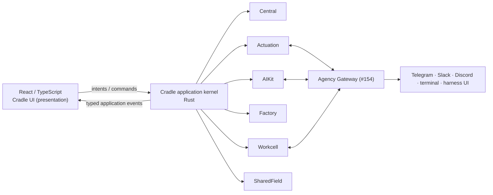

# 02 — Cradle architecture

**Status:** architecture commitment for the O:I desktop.
**Companion:** [01-DESIGN.md](01-DESIGN.md) (intent), [03-UX-STATES.md](03-UX-STATES.md) (states), [04-VERIFICATION.md](04-VERIFICATION.md) (evidence).

**20 September 2026 clarification:** §6 explicitly includes retained kernel loading/resource state. Read [Wiki/constellation decisions WC01–WC15](../positions/WIKI-CONSTELLATION-PRACTICE.md) and the [joined development map](../../.wayfinder/maps/wiki-constellation-development.md) for its purpose and application. The dated implementation disposition in §11 remains historical evidence, not a finding about the owner's incoming local mains.

## 1. Stack and kernel

Tauri + Rust + React/TypeScript. React sits on top of a **real O:I application
kernel** — a small set of coarse application services composing the native
products — rather than on dozens of widget-scoped read-model calls. The renderer is a deterministic
projection of kernel events, and every human intent becomes a native operation
through the kernel.



## 2. The kernel is the current constitution of the environment

The kernel is not another database containing copies of everything. It is the
**current constitution of the environment** — what #158 calls the composition,
read as inhabitation:

```rust
Cradle {
    world: WorldRef,                    // Central ground + recognised machines
    project: Option<ProjectRef>,
    focus: Option<SubjectRef>,          // the one global subject (§7)
    journey: Option<JourneyRef>,        // active structured development, if any

    session_space: SessionSpaceRef,     // AIKit working environment
    agencies: Vec<AgencyPresence>,      // who is present (Gateway-informed)
    agent_sessions: Vec<AgentSessionPresence>,

    surfaces: SurfaceLayout,            // composed surface bindings (§8)
    attention: AttentionState,          // what requires the human
    composition: EffectiveComposition,  // products present / degraded / absent
    material: MaterialSituation,        // Workcell: bodies, services, placement
}
```

Composition asks what is constituted together; inhabitation asks what that
constitution means for the situated human and Agencies — the kernel answers
both, and the UI renders the answer.

## 3. Coarse application services

Ten services, not one command per widget. The first six **compose native
products**; the last four genuinely belong to the application whole.

| Service | Composes | Owns |
|---|---|---|
| `WorldService` | Central (`ctrl`), oi recognition | The first-class authored World (`WorldRef` tree with source treatment), Ground, Work files, machine/install recognition — read as a **selected Projection** (selection ≠ readability; omission by default), never as a profile database |
| `AgencyService` | Actuation, AIKit sessions, Gateway #154 | Agencies, AgentSessions, activity, encounter continuity |
| `KnowledgeService` | AIKit knowledge, Central | Search, semantic neighbourhoods, disclosure receipts, remember-this |
| `DevelopmentService` | Factory | Journeys, Runs, Candidates, Evidence, Recognition |
| `MaterialService` | Workcell | Material bodies, services, placement, bindings |
| `SharedFieldService` | shared-field contracts | Projections, participants, contributions, encounters |
| `SurfaceService` | — (application) | Surface registry, bindings, promotion/detach, layout |
| `ActionRouter` | — (application) | Intent → owner Action dispatch, authority gates |
| `SearchService` | — (application) | The one command/search aggregator over native descriptors |
| `AttentionService` | — (application) | Activity → Notification → Attention altitudes |

## 4. The integration ladder

Where a product exposes a clean Rust crate, use it in-process. Where it is
independently executable, use its stable CLI/application protocol. Where it is
persistent/networked, use its service protocol. **The renderer does not care.**

```text
React intent
  ↓
kernel service operation
  ↓
Rust adapter
  ├── in-process crate API        (factory, aikit-core/store today)
  ├── native CLI protocol         (ctrl, aikit, actuation, factory, workcell, ql)
  ├── local IPC / stdio           (ACP agent sessions, Gateway UDS)
  └── service / network API       (Gateway WebSocket, hosted SharedField)
```

This lets moving-but-stable product heads keep moving without binding the UI to
their internals. Every adaptation is honest at the UI: which seam served a
reading is disclosed (see the provider-truth law, §10).

## 5. Commands and events

```text
COMMANDS (human and agent intent)              EVENTS (kernel → renderer)
open subject                ◀────────────────  FocusChanged
execute Action              ◀────────────────  WorldChanged
edit / save / author        ◀────────────────  SourceChanged
send / address / interrupt  ◀────────────────  ActivityUpdated · SessionChanged
stage composition           ◀────────────────  KnowledgeChanged
resolve Attention           ◀────────────────  AttentionRaised · AttentionResolved
compose projection          ◀────────────────  RunChanged · JourneyChanged
create Agent from intent    ◀────────────────  MaterialChanged · CompositionChanged
                                             SharedFieldChanged
```

The key loop: **native operation returns → kernel state changes → typed events
→ React projection re-renders reality.** No optimistic fake mutation followed by
a "saved" card. Push, not poll: the current build's absence of any event seam is
the single largest infrastructure gap (§11).

## 6. Three state responsibilities — native work, retained resources, presentation

**Owner-directed clarification, 20 September 2026.** The earlier two-layer
account distinguished semantic authority from presentation correctly but did
not name the kernel's loading/resource continuity responsibility. It must not
be read as a prohibition on caching. The existing third-layer implementation
and [workspace continuity](../experience/WORKSPACE-CONTINUITY.md) are the
reconciliation targets; this is not a fourth store or framework migration.

**Semantic/application state** belongs to its kernel or native owner: World,
Project, Source, Knowledge, Agency, AgentSession, Journey, Run, SharedField,
Activity, Attention, material state, Action results, and the existing native
constellation/Expression work. Authoritative identity, source revisions,
permissions and durable semantic mutation stay there.

**Retained kernel loading/resource state** keeps the working readings available
above disposable views: source and directory readings, knowledge adjacency and
index projections, shared working-model handles, request generations,
in-flight deduplication, revision/currentness, per-provider availability and
subscriptions. It composes and caches owner readings; it does not become a
second authoritative Wiki, filesystem, session or Scene database. Existing
kernel source buffers remain the single editable model where already owned.
An adapter which is not a store may still consume this retained state.

**Presentation state** belongs to the desktop: open Surface bindings, split
arrangement, panel widths, resting/summoned regions, drawer, focused
presentation, scroll/camera, graph filters/expansion, popovers and view
checkpoints. Drafts and working models survive view disposal through their
existing shared owner/model path, not isolated competing copies in each view.

The responsibilities cooperate:

```text
native owner / application work + revision and authority
                        ↓ readings / receipts / invalidation
retained kernel resources + shared models + in-flight work
                        ↓ targeted subscriptions / usable partial readings
presentation bindings + live views + restorable checkpoints
```

Rules:

1. Never derive semantic truth or authority from presentation coordinates,
   cache presence or a restored view. Deliberate semantic authoring still uses
   the real owner Action; the ownership rule does not make Technè read-only.
2. Presentation is real product state: persisted, versioned and restorable.
   Resource retention is also legitimate product infrastructure. Neither is
   made unimportant by not owning source truth.
3. Semantic focus remains kernel-owned (§7). Layout checkpoints may retain a
   reference needed to restore that focus, but do not create a second focus
   authority or silently disclose the selected source to an agent.
4. Resource keys include native World/owner/ref, operation/query, revision or
   version basis and access/provider epoch. Equivalent authorised reads share
   work. Dirty models, stale responses and revoked access receive explicit
   treatment; a cache hit is not a fresh permission grant.
5. Independent local readings may be presented while another provider is slow
   or absent. Keep partial/completeness and per-owner revision basis visible.
   Save operations bind the coherent basis they actually require; no global
   revision or distributed transaction is fabricated.
6. Warm return does not cold-read files, re-enumerate the tree or reconstruct
   unchanged formations solely because visibility changed. Restart restores
   useful permitted models/checkpoints and then reconciles their currentness.
7. Native receipts/change observations invalidate affected resources. Preserve
   write ordering, bounded concurrency and subscribers; update only affected
   consumers. A no-cache comment in old code is an implementation decision to
   revise, not a constitutional prohibition.

Live-view retention, resource/model continuity and durable recovery are the
three cooperating continuity mechanisms, not replacement names for these
ownership responsibilities. Likewise, source field/constellation organisation
and Expressions/Technè are semantic and application-mode distinctions, not
state-layer classifications. [Wiki/constellation specification §9](WIKI-CONSTELLATION-SPEC.md#9-kernel-loadingresource-state-and-performance)
gives the concrete read, invalidation and performance contract.

## 7. One global focus model

The whole application shares one notion of *what we are currently talking
about* — a stable `SubjectRef` plus its surrounding relations:

```text
Current World · Current Project · Current Focus (SubjectRef)
Current Journey · Current Agency encounter
```

Selecting `src/project.rs` yields `SubjectRef = Central source ref`,
`ProjectRef`, `WorldRef`. From that one relation: the canvas opens the editor;
knowledge shows its neighbourhood; the Cradle addresses an agent about *that
exact subject*; Factory shows Runs touching it; history shows change; search
recentres; SharedField can project it if eligible. No component copies selection
state independently. This is the backbone of human/agent co-reference: an agent
receives refs to selected subjects, never pasted screen text.

Focus changes propagate as events (§5). Focus is semantic state — kernel-owned,
not a UI store.

## 8. Tabs are Surface bindings

A tab is not a page URL. It is:

```text
SurfaceBinding {
    surface_ref      // which presentation
    subject_ref      // which subject it shows
    provider         // which service/product supplies it
    region           // centre · left · summoned · drawer · detached
    presentation     // mode (read/edit/graph/…)
    local_state      // view checkpoint; shared dirty model remains above the view (§6)
}
```

The same binding can move: centre tab → split; summoned aperture → centre
panel; centre surface → detached window; detached Observatory → back into the
left field. Same subject, same binding, different area and region. Bindings are
presentation identity, non-canonical; the *subject* is canonical and
native-owned.

## 9. Product seams — the four-part contract

Every native product already converges on the same integration shape; the
kernel consumes them uniformly:

1. **Capabilities descriptor** — `ctrl action.list`, `factory capabilities`,
   `aikit` profile/context resolution, `actuation.cli/v1` surface descriptor,
   `ql capabilities`, Workcell SDK/wire.
2. **Read-model projection without mutation** — Factory `build-view/v1`,
   Central `personal.show`, AIKit effective-skill/context readings,
   Actuation `agency.read / realised.read / activity.read / stream.read`.
3. **Opaque client-owned refs** — Workcell `ExternalRef`, QL client subjects,
   Factory's preserved AIKit/Actuation/Workcell refs. No product re-owns
   another's nouns; the kernel treats them as opaque and routes by owner.
4. **Explicit authority gates on mutation** — Central CAS + `accepted_by_ref`
   proposals, Factory bounded Action grants, AIKit reviewable Procedures,
   Actuation recognition-before-mutation. The desktop adds no bypass: rich
   rendered code is never a privileged caller (§12).

## 10. Honesty laws (rendered, not implied)

- **Provider truth:** `live-provider → may claim live; fixture → Degraded;
  derived-only → Degraded`. The UI never upgrades a source class, anywhere in
  the application.
- **Absence is an observation, not a failure.** An uninstalled product, a
  stopped daemon, an unprojected skill, a missing version flag: rendered as
  what-is, never as error, never fabricated.
- **Degradation is local.** A provider disappearing degrades one reading; the
  SessionSpace and other relations keep their identity
  (`provider pane ≠ SurfaceRef ≠ SessionSpaceRef`).
- **Authority is visible.** An action discoverable is not an action authorised;
  the UI shows which authority stands behind each mutation.

## 11. Current build disposition (implementation facts)

Evidence: `desktop/core`, `desktop/src-tauri/main.rs` (39 commands, zero
events), `desktop/ui/src` as of 2026-09-04.

**Keep and build on (real today):** the workbench host frame with tabs/splits/
regions/keyboard grammar (`workbench-host.tsx`); Flow authoring with CAS
revision conflict; AgentProfile CRUD over `ctrl`; Knowledge
search/read/relations/explain/history; real ACP agent conversation with
canonical AgentSession identity; Factory bounded Action dispatch;
SessionSpace focus.

**Mount (written, tested, unreachable):** participant composer (To:/@
addressing, `participant-composer-model.mjs`); the full session observatory /
activity / notification / attention model (`session-observatory-model.mjs`);
the real Factory `BuildSurface` body in place of the summary cards now rendered.

**Add (the load-bearing gaps):** the event seam (Tauri channel + native change
sources); global focus events and subject-scoped read models; streaming and
concurrent ACP sessions with mid-turn interrupt; the Actuation payload adapter
(`agency.read`/`activity.read`/`stream.read` → kernel); intent-created Agent
resolution (AIKit AgentProfile + compose + Workcell placement as one flow);
Journey/Run readings from Factory; live World/file editing through Central
owner-Actions; the Agency Gateway integration for cross-surface continuity.

**Retire/replace:** the static System constitution table → live composition
reading (what is present/degraded/absent, from recognition + capability
descriptors); descriptor cards for region surfaces → real region renderers;
env-var JSON handoffs → kernel services (the handoff files were honest scaffolding);
Explore stays read-only until SharedField has a live substrate — the desktop
must not simulate one.

## 12. Security boundary

`rendered UI → named kernel commands → BridgePolicy → native operation`. No
generic shell, filesystem, process, network or secret bridge; the capability
grant remains `core:default`; contribution code is never the authorising
caller. What the kernel may do on the human's behalf runs through the owner
products' own authority gates (§9.4), surfaced as visible grants, never as
ambient power.

## 13. Omarchy and the larger host (#158/#159)

The kernel's composition is scope-neutral: the same inhabitation reading serves
the desktop on macOS, and the Omarchy reference World where the desktop is an
integral Quickshell-composed constituent of the host shell. The desktop owns the
whole application experience; Omarchy owns shell config, plugin discovery and
hot-reload; neither imports the other's identity (`file presence ≠ activation`;
`tmux pane ≠ SurfaceRef`; `Quickshell widget ≠ Surface`). Adaptive bootstrap
(`oi host omarchy plan|realise|verify`) is World recognition, not installation
of a foreign app.


## 14. Agency Gateway desktop consumer contract

Owner-directed desktop clarification,2026-09-06. Native specification remains
[O-I #154](https://github.com/EpiLogos/O-I/issues/154); this section gives its
existing architecture placement (§1/§3/§4) an explicit consumer boundary. The
product team develops the Gateway/connector/Stream/hosting implementation.
Execution units GW-01–06 live in
[the programme](../../.superpowers/sdd/cradle-rebuild/IMPLEMENTATION-PROGRAMME-2026-09-06.md#agency-gateway-desktop-integration--explicit-dependency-track).

`AgencyService` consumes AIKit's authorised ecology and native Gateway client
through S's declared integration route. Use the product protocol/SDK and its
negotiated local/network carrier; no renderer-owned websocket protocol or second
connector/session registry. The desktop owns view binding, attention and focus,
not Agency, AgentSession, ActuationStream or connector identity. Workcell owns
service/Fabric materiality; Actuation owns attributable Stream and authority.

| Owner input, where supplied and authorised | Desktop projection |
|---|---|
| SessionSpace, Agency/Agent, AgentSession, purpose and Focus | Existing-session selection and agent details in the dynamic right panel; selection attaches the actual owner session |
| Actuation/ActuationStream, sequence/cursor, attribution/locus, native evidence and Return refs | Conversation and semantic Activity over the same encounter; ordered incremental reading/replay with native correlation intact |
| Operative Context, resolved Harness/model condition, context revision/lineageage | Context and Inspect planes; authored, effective and actually active facts remain distinct |
| Surface, connection, reachability, material observation, compatibility and age | Side/full/tab/detached/Observatory views with exact serving seam and local degraded/last-observed state |
| Available/granted capabilities and permitted invocation modes | Owner-disclosed operations with exact scope/refusal; presence and reachability never imply authority |

One canonical encounter retains one transcript, draft/composer and native session
across presentations. ActuationStream is the semantic event source for Gateway
integration; native provider traces/exposed thinking retain their richer content
and attribution. ACP connection events alone do not establish canonical Stream
or cross-surface Gateway acceptance. Preserve bounded retention/backpressure and
durable owner replay; a replay gap or unsupported operation is not repaired with
fabricated events. Continue/refine/fork/recompose are explicit owner relations.

A disappearing UI consumer detaches its view; it does not cancel the provider or
Gateway. Explicit cancel is a separate owner operation. Provider conversation IDs,
transport credentials, sockets/hosts and Fabric addresses never become canonical
AgentSession identity. Fabric admission, Gateway scopes, AIKit capabilities,
Actuation bounds and native Action authority remain separate.

Until a compatible native ecology/attach operation is available, disclose the
missing seam and affected reachability. Local sources/wiki/workspaces remain
usable. Reuse the existing resident encounter only with its truthful local scope;
never call it the Gateway, introduce another persistent desktop encounter owner,
or replace an active provider to force an upgrade. A subsequent owner-supported
binding/migration must prove preserved identity and history explicitly.