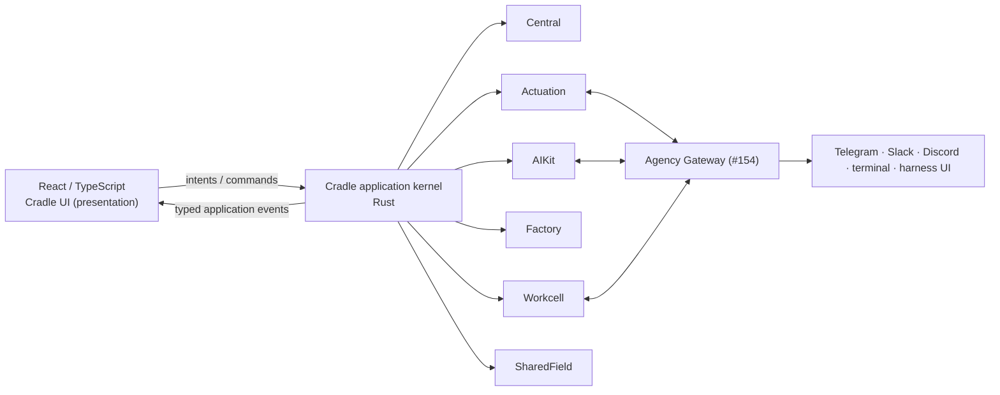

# 02 — Cradle architecture

**Status:** architecture commitment for the O:I desktop.
**Companion:** [01-DESIGN.md](01-DESIGN.md) (intent), [03-UX-STATES.md](03-UX-STATES.md) (states), [04-VERIFICATION.md](04-VERIFICATION.md) (evidence).

## 1. Stack and kernel

Tauri + Rust + React/TypeScript. React sits on top of a **real O:I application
kernel** — a small set of coarse application services composing the native
products — rather than on dozens of widget-scoped read-model calls. The renderer is a deterministic
projection of kernel events, and every human intent becomes a native operation
through the kernel.



## 2. The kernel is the current constitution of the environment

The kernel is not another database containing copies of everything. It is the
**current constitution of the environment** — what #158 calls the composition,
read as inhabitation:

```rust
Cradle {
    world: WorldRef,                    // Central ground + recognised machines
    project: Option<ProjectRef>,
    focus: Option<SubjectRef>,          // the one global subject (§7)
    journey: Option<JourneyRef>,        // active structured development, if any

    session_space: SessionSpaceRef,     // AIKit working environment
    agencies: Vec<AgencyPresence>,      // who is present (Gateway-informed)
    agent_sessions: Vec<AgentSessionPresence>,

    surfaces: SurfaceLayout,            // composed surface bindings (§8)
    attention: AttentionState,          // what requires the human
    composition: EffectiveComposition,  // products present / degraded / absent
    material: MaterialSituation,        // Workcell: bodies, services, placement
}
```

Composition asks what is constituted together; inhabitation asks what that
constitution means for the situated human and Agencies — the kernel answers
both, and the UI renders the answer.

## 3. Coarse application services

Ten services, not one command per widget. The first six **compose native
products**; the last four genuinely belong to the application whole.

| Service | Composes | Owns |
|---|---|---|
| `WorldService` | Central (`ctrl`), oi recognition | The first-class authored World (`WorldRef` tree with source treatment), Ground, Work files, machine/install recognition — read as a **selected Projection** (selection ≠ readability; omission by default), never as a profile database |
| `AgencyService` | Actuation, AIKit sessions, Gateway #154 | Agencies, AgentSessions, activity, encounter continuity |
| `KnowledgeService` | AIKit knowledge, Central | Search, semantic neighbourhoods, disclosure receipts, remember-this |
| `DevelopmentService` | Factory | Journeys, Runs, Candidates, Evidence, Recognition |
| `MaterialService` | Workcell | Material bodies, services, placement, bindings |
| `SharedFieldService` | shared-field contracts | Projections, participants, contributions, encounters |
| `SurfaceService` | — (application) | Surface registry, bindings, promotion/detach, layout |
| `ActionRouter` | — (application) | Intent → owner Action dispatch, authority gates |
| `SearchService` | — (application) | The one command/search aggregator over native descriptors |
| `AttentionService` | — (application) | Activity → Notification → Attention altitudes |

## 4. The integration ladder

Where a product exposes a clean Rust crate, use it in-process. Where it is
independently executable, use its stable CLI/application protocol. Where it is
persistent/networked, use its service protocol. **The renderer does not care.**

```text
React intent
  ↓
kernel service operation
  ↓
Rust adapter
  ├── in-process crate API        (factory, aikit-core/store today)
  ├── native CLI protocol         (ctrl, aikit, actuation, factory, workcell, ql)
  ├── local IPC / stdio           (ACP agent sessions, Gateway UDS)
  └── service / network API       (Gateway WebSocket, hosted SharedField)
```

This lets moving-but-stable product heads keep moving without binding the UI to
their internals. Every adaptation is honest at the UI: which seam served a
reading is disclosed (see the provider-truth law, §10).

## 5. Commands and events

```text
COMMANDS (human and agent intent)              EVENTS (kernel → renderer)
open subject                ◀────────────────  FocusChanged
execute Action              ◀────────────────  WorldChanged
edit / save / author        ◀────────────────  SourceChanged
send / address / interrupt  ◀────────────────  ActivityUpdated · SessionChanged
stage composition           ◀────────────────  KnowledgeChanged
resolve Attention           ◀────────────────  AttentionRaised · AttentionResolved
compose projection          ◀────────────────  RunChanged · JourneyChanged
create Agent from intent    ◀────────────────  MaterialChanged · CompositionChanged
                                             SharedFieldChanged
```

The key loop: **native operation returns → kernel state changes → typed events
→ React projection re-renders reality.** No optimistic fake mutation followed by
a "saved" card. Push, not poll: the current build's absence of any event seam is
the single largest infrastructure gap (§11).

## 6. Two state layers — both real

**Semantic/application state** lives in the kernel and native products: World,
Project, Source, Knowledge, Agency, AgentSession, Journey, Run, SharedField,
Activity, Attention, material state, Action results.

**Presentation state** lives in the desktop: open surface bindings, split
arrangement, panel widths, resting vs summoned regions, drawer, focused
presentation, scroll positions, popover state, draft composer content.

Rules:

1. Never derive semantic state from presentation state.
2. Presentation state is **real product state** — persisted professionally,
   versioned, restorable; "presentation isn't semantic authority" never mutated
   into "presentation doesn't matter".
3. Layout persistence never persists semantic selection.

## 7. One global focus model

The whole application shares one notion of *what we are currently talking
about* — a stable `SubjectRef` plus its surrounding relations:

```text
Current World · Current Project · Current Focus (SubjectRef)
Current Journey · Current Agency encounter
```

Selecting `src/project.rs` yields `SubjectRef = Central source ref`,
`ProjectRef`, `WorldRef`. From that one relation: the canvas opens the editor;
knowledge shows its neighbourhood; the Cradle addresses an agent about *that
exact subject*; Factory shows Runs touching it; history shows change; search
recentres; SharedField can project it if eligible. No component copies selection
state independently. This is the backbone of human/agent co-reference: an agent
receives refs to selected subjects, never pasted screen text.

Focus changes propagate as events (§5). Focus is semantic state — kernel-owned,
not a UI store.

## 8. Tabs are Surface bindings

A tab is not a page URL. It is:

```text
SurfaceBinding {
    surface_ref      // which presentation
    subject_ref      // which subject it shows
    provider         // which service/product supplies it
    region           // centre · left · summoned · drawer · detached
    presentation     // mode (read/edit/graph/…)
    local_state      // dirty buffer, scroll — presentation layer (§6)
}
```

The same binding can move: centre tab → split; summoned aperture → centre
panel; centre surface → detached window; detached Observatory → back into the
left field. Same subject, same binding, different area and region. Bindings are
presentation identity, non-canonical; the *subject* is canonical and
native-owned.

## 9. Product seams — the four-part contract

Every native product already converges on the same integration shape; the
kernel consumes them uniformly:

1. **Capabilities descriptor** — `ctrl action.list`, `factory capabilities`,
   `aikit` profile/context resolution, `actuation.cli/v1` surface descriptor,
   `ql capabilities`, Workcell SDK/wire.
2. **Read-model projection without mutation** — Factory `build-view/v1`,
   Central `personal.show`, AIKit effective-skill/context readings,
   Actuation `agency.read / realised.read / activity.read / stream.read`.
3. **Opaque client-owned refs** — Workcell `ExternalRef`, QL client subjects,
   Factory's preserved AIKit/Actuation/Workcell refs. No product re-owns
   another's nouns; the kernel treats them as opaque and routes by owner.
4. **Explicit authority gates on mutation** — Central CAS + `accepted_by_ref`
   proposals, Factory bounded Action grants, AIKit reviewable Procedures,
   Actuation recognition-before-mutation. The desktop adds no bypass: rich
   rendered code is never a privileged caller (§12).

## 10. Honesty laws (rendered, not implied)

- **Provider truth:** `live-provider → may claim live; fixture → Degraded;
  derived-only → Degraded`. The UI never upgrades a source class, anywhere in
  the application.
- **Absence is an observation, not a failure.** An uninstalled product, a
  stopped daemon, an unprojected skill, a missing version flag: rendered as
  what-is, never as error, never fabricated.
- **Degradation is local.** A provider disappearing degrades one reading; the
  SessionSpace and other relations keep their identity
  (`provider pane ≠ SurfaceRef ≠ SessionSpaceRef`).
- **Authority is visible.** An action discoverable is not an action authorised;
  the UI shows which authority stands behind each mutation.

## 11. Current build disposition (implementation facts)

Evidence: `desktop/core`, `desktop/src-tauri/main.rs` (39 commands, zero
events), `desktop/ui/src` as of 2026-09-04.

**Keep and build on (real today):** the workbench host frame with tabs/splits/
regions/keyboard grammar (`workbench-host.tsx`); Flow authoring with CAS
revision conflict; AgentProfile CRUD over `ctrl`; Knowledge
search/read/relations/explain/history; real ACP agent conversation with
canonical AgentSession identity; Factory bounded Action dispatch;
SessionSpace focus.

**Mount (written, tested, unreachable):** participant composer (To:/@
addressing, `participant-composer-model.mjs`); the full session observatory /
activity / notification / attention model (`session-observatory-model.mjs`);
the real Factory `BuildSurface` body in place of the summary cards now rendered.

**Add (the load-bearing gaps):** the event seam (Tauri channel + native change
sources); global focus events and subject-scoped read models; streaming and
concurrent ACP sessions with mid-turn interrupt; the Actuation payload adapter
(`agency.read`/`activity.read`/`stream.read` → kernel); intent-created Agent
resolution (AIKit AgentProfile + compose + Workcell placement as one flow);
Journey/Run readings from Factory; live World/file editing through Central
owner-Actions; the Agency Gateway integration for cross-surface continuity.

**Retire/replace:** the static System constitution table → live composition
reading (what is present/degraded/absent, from recognition + capability
descriptors); descriptor cards for region surfaces → real region renderers;
env-var JSON handoffs → kernel services (the handoff files were honest scaffolding);
Explore stays read-only until SharedField has a live substrate — the desktop
must not simulate one.

## 12. Security boundary

`rendered UI → named kernel commands → BridgePolicy → native operation`. No
generic shell, filesystem, process, network or secret bridge; the capability
grant remains `core:default`; contribution code is never the authorising
caller. What the kernel may do on the human's behalf runs through the owner
products' own authority gates (§9.4), surfaced as visible grants, never as
ambient power.

## 13. Omarchy and the larger host (#158/#159)

The kernel's composition is scope-neutral: the same inhabitation reading serves
the desktop on macOS, and the Omarchy reference World where the desktop is an
integral Quickshell-composed constituent of the host shell. The desktop owns the
whole application experience; Omarchy owns shell config, plugin discovery and
hot-reload; neither imports the other's identity (`file presence ≠ activation`;
`tmux pane ≠ SurfaceRef`; `Quickshell widget ≠ Surface`). Adaptive bootstrap
(`oi host omarchy plan|realise|verify`) is World recognition, not installation
of a foreign app.
